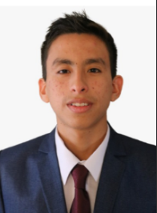
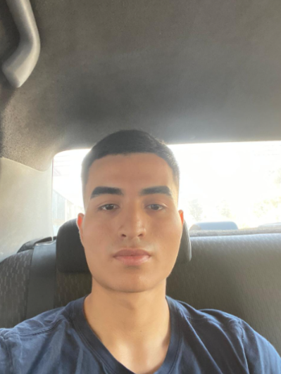
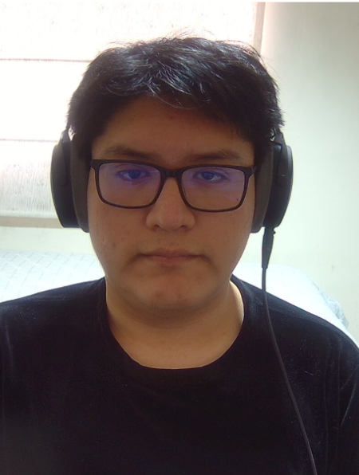
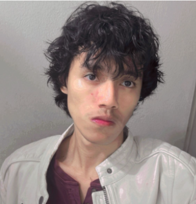

## Capítulo I: Introducción

### 1.1 Startup Profile

#### 1.1.1 Descripción de la Startup

Nuestro startup, denominada "Developer Team", surge con el objetivo de resolver la falta de digitalización y visibilidad en la gestión de flotas de transporte en el Perú, un problema que afecta tanto a empresas de transporte de carga y pasajeros como a operadores de taxi.

Actualmente, la mayoría de estos actores administra sus vehículos mediante hojas de cálculo, cuadernos de control físico o coordinación telefónica, lo que genera desconocimiento del estado real de la flota, gasto excesivo de combustible, mantenimientos correctivos costosos (en lugar de preventivos) y una experiencia de viaje poco confiable para el pasajero final.

La misión de Developer Team es centralizar en una sola plataforma inteligente el control, monitoreo y optimización de toda la operación de flota, integrando tecnología IoT y GPS para capturar datos objetivos y en tiempo real sobre combustible, kilometraje y estado mecánico de cada unidad. De esta forma, administradores y conductores dejan de operar "a ciegas" y pasan a tomar decisiones basadas en datos, mientras que empresas y pasajeros ganan trazabilidad y confianza sobre el servicio.

A futuro, Developer Team proyecta evolucionar hacia funcionalidades de optimización de rutas asistida por datos históricos de consumo y mantenimiento, así como hacia la venta directa de un kit de hardware propio (dispositivo IoT con GPS, odómetro y sensor de combustible), consolidándose como una solución integral software y hardware para la gestión de flotas en Latinoamérica.

#### 1.1.2 Perfiles de integrantes del equipo

| | |
|---|---|
|  | **Nombre:** Jaime Forcelledo, Gonzalo Alexander **Código:** U202319329 **Conocimientos y habilidades:** Me considero una persona curiosa y apasionada por el aprendizaje continuo. La música me encanta, descubrir nuevos géneros y artistas para enriquecer mis experiencias auditivas. |
|  | **Nombre:** Ramirez Rodriguez, Mauricio Joao **Código:** U202218235 **Conocimientos y habilidades:** Me considero una persona responsable y autodidacta. Me gusta hacer mucho deporte para así mantenerme activo. |
|  | **Nombre:** *Lechuga Aguilar, Joaquin Andre* **Código:** *U202221619* **Conocimientos y habilidades:** Soy programador aficionado. Me gusta aprender tecnologías y aplicarlas a proyectos personales. Mis hobbies son la música y los videojuegos. Como miembro del grupo, espero aportar en la organización, conceptos técnicos e ideas. |
|  | **Nombre:** *Olivares Lao, Gustavo Alonso* **Código:** *U202216448* **Conocimientos y habilidades:** *Me considero una persona práctica y curiosa con cada nuevo conocimiento adquirido. Explorar el mundo que me rodea me enriquece para poder aplicar mis conocimientos y brindar soluciones que ayuden a los demás.* |