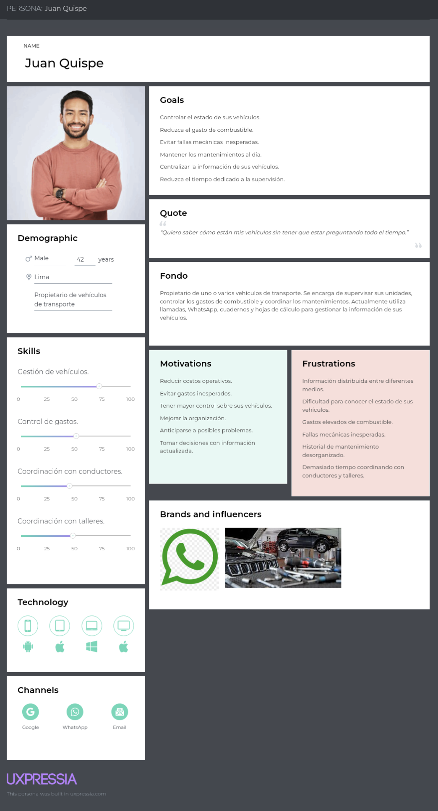
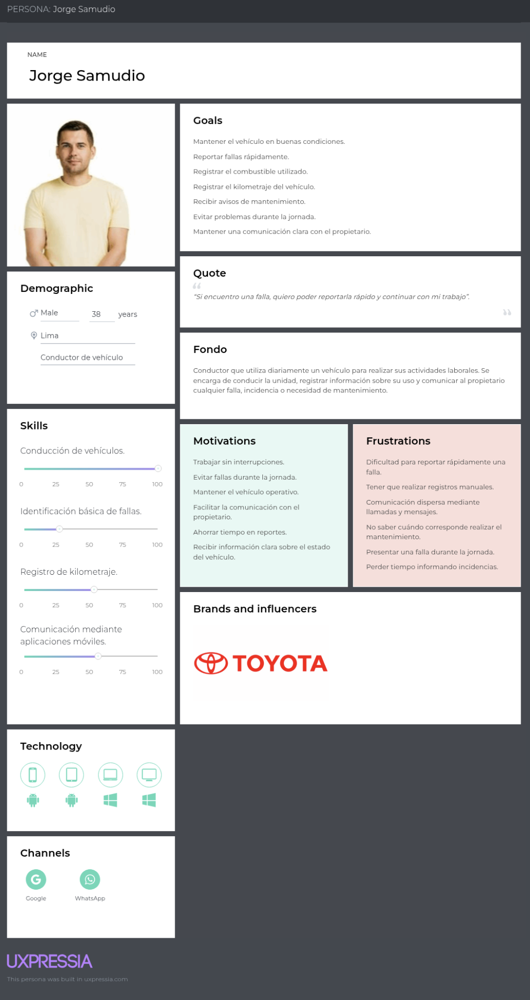
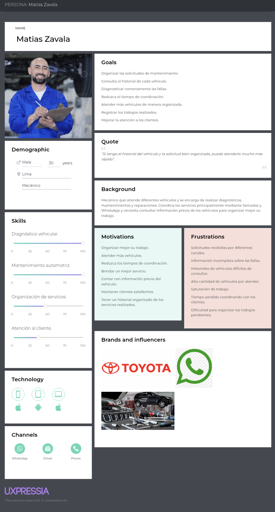
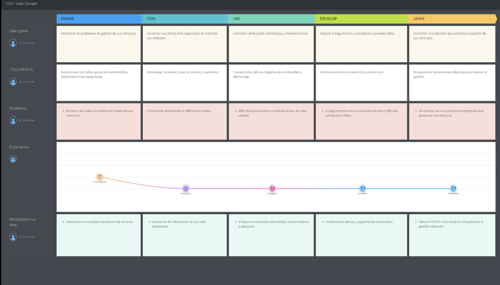
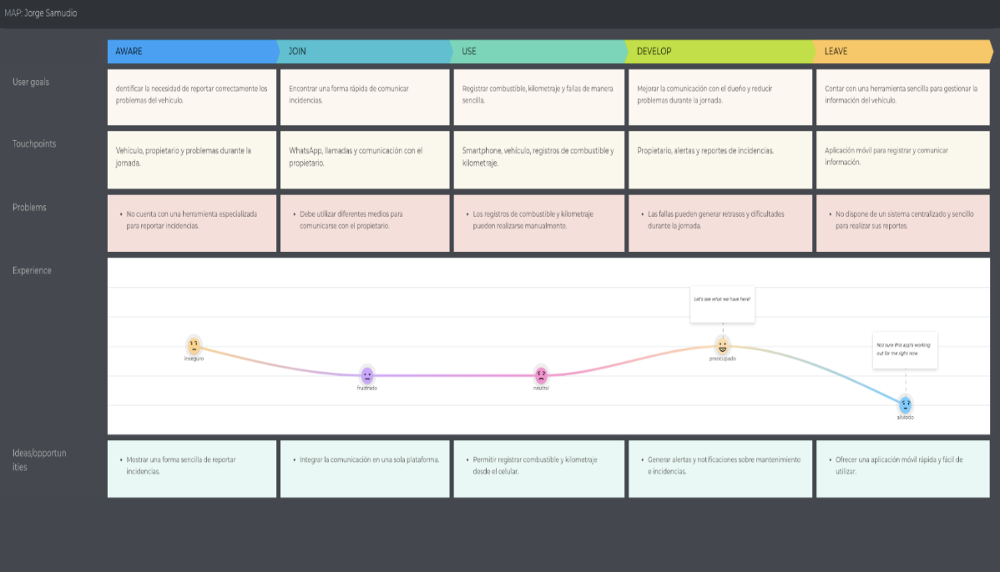
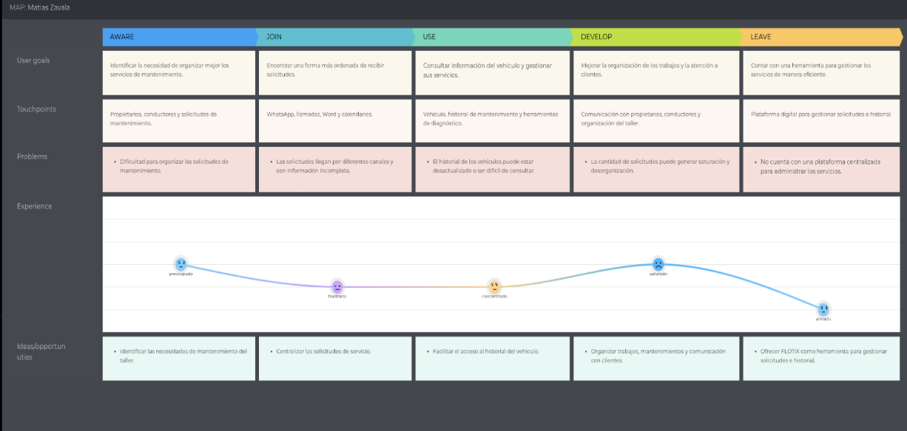
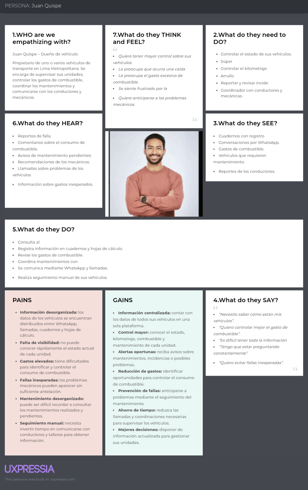
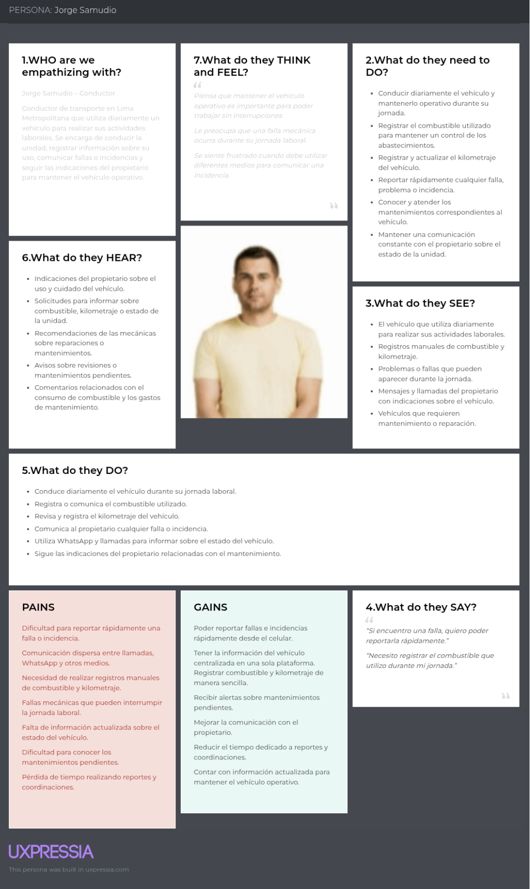
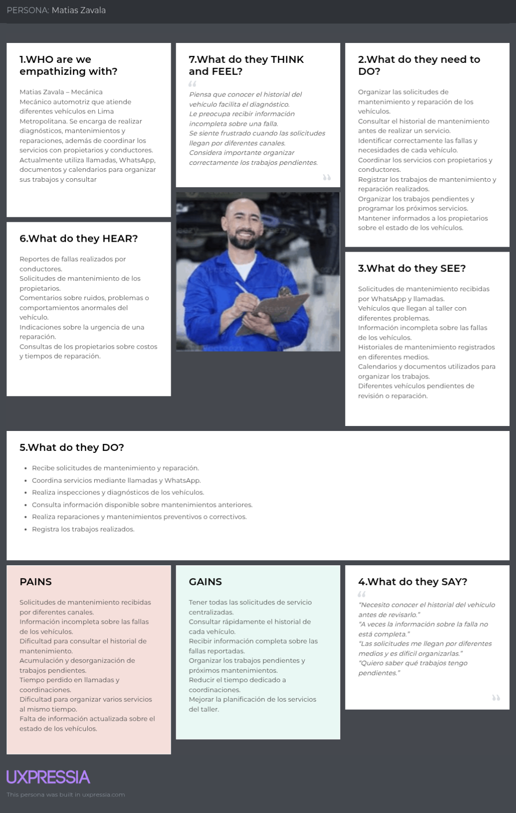

## 2.3. Needfinding

### 2.3.1. User Personas

En esta sección se presentan las User Personas de los segmentos objetivo de FLOTIX, construidas a partir del análisis de las entrevistas y del contexto del mercado. Estos arquetipos representan las principales necesidades, comportamientos, objetivos y frustraciones de los usuarios involucrados en la gestión de flotas, y sirven como base para orientar el diseño de la solución.

#### User Persona del 1er segmento objetivo – Dueños de vehículos

**Juan Quispe** representa al segmento de dueños de vehículos, construido a partir de las entrevistas realizadas a *Karen Forcelledo*. Se definió como una persona de *39* años, ubicada en Lima, que posee uno o varios vehículos destinados al transporte particular, de pasajeros o de carga, y que participa directamente en las decisiones relacionadas con el combustible, mantenimiento y operación de sus unidades. Sus objetivos de mantener un mayor control sobre sus vehículos, reducir el gasto de combustible, conocer oportunamente el estado de sus unidades y prevenir fallas mecánicas responden a las principales necesidades identificadas en el segmento. Sus frustraciones están relacionadas con el uso de hojas de cálculo, cuadernos o aplicaciones de mensajería para registrar información, la dificultad para conocer el estado real de cada vehículo y la necesidad de coordinar los mantenimientos mediante llamadas o mensajes con los talleres. También existe preocupación por los costos generados por mantenimientos correctivos inesperados y por no contar con información centralizada para tomar decisiones. Sus principales influencias están relacionadas con empresas y servicios del sector automotriz y de transporte que ofrecen soluciones de monitoreo y gestión vehicular. Sus canales incluyen WhatsApp, llamadas, hojas de cálculo, computadora y smartphone, utilizados para coordinar con conductores, talleres y realizar el seguimiento de sus vehículos.

#### User Persona del 2do segmento objetivo – Conductores

**Jorge Samudio** representa al segmento de conductores, construido a partir de la entrevista realizada a Ronald Enrique Ramirez, conductor de 51 años ubicado en Lima. Su perfil representa a las personas que operan diariamente un vehículo y que tienen contacto directo con actividades como el abastecimiento de combustible, control del kilometraje, identificación de incidencias y comunicación de problemas mecánicos al dueño o administrador. Sus objetivos se centran en realizar su jornada de manera eficiente, mantener el vehículo en buenas condiciones y comunicar rápidamente cualquier incidencia que pueda afectar su trabajo. Sus frustraciones están relacionadas con los procesos manuales para reportar fallas, la comunicación con el dueño o administrador y la falta de mecanismos simples que permitan registrar información del vehículo durante la jornada. Debido a que el conductor necesita concentrarse en la operación del vehículo, una herramienta demasiado compleja podría dificultar su adopción. Por ello, valora soluciones rápidas, sencillas y accesibles desde el smartphone. Sus principales canales son WhatsApp, llamadas y smartphone, que utiliza para comunicarse con el propietario o administrador y reportar incidencias relacionadas con el vehículo.

#### User Persona del 3er segmento objetivo – Mecánicas

**Matias Zavala** representa al segmento de mecánicas, construido a partir de la entrevista realizada a Jorge Zambudio Alcántara, mecánico automotriz de 27 años ubicado en Lima. Su perfil representa a técnicos y talleres mecánicos que atienden vehículos particulares y de empresas y que necesitan organizar las solicitudes de mantenimiento, consultar información de los vehículos y administrar los trabajos pendientes. Su objetivo principal es organizar mejor la atención de sus clientes, reducir el tiempo dedicado a coordinar servicios y disponer de información suficiente sobre cada vehículo antes de realizar un diagnóstico. La entrevista evidencia que actualmente utiliza llamadas, WhatsApp, Word y calendarios para gestionar clientes y mantenimientos, mientras que el historial de los vehículos, aunque existe, resulta difícil de consultar y no siempre contiene información completa sobre reparaciones o accidentes anteriores. Sus principales frustraciones aparecen cuando existe una alta demanda de servicios y pocos mecánicos disponibles, generando saturación y dificultades para organizar las atenciones. Además, considera útil contar con el historial del vehículo antes de recibirlo para mantenimiento, aunque señala que el diagnóstico debe ser realizado directamente por el equipo de mecánicos y no mediante un preprocesamiento automático. Sus canales actuales incluyen WhatsApp, llamadas, Word y calendarios, herramientas que utiliza para coordinar servicios, organizar trabajos y mantener comunicación con sus clientes.

### 2.3.2. User Task Matrix

Para diseñar una solución que permita optimizar la gestión y operación de flotas de transporte, se identificaron tres tipos de usuarios clave: los dueños de vehículos, responsables de supervisar las unidades y tomar decisiones relacionadas con combustible, mantenimiento y operación; los conductores, encargados de operar diariamente los vehículos y reportar información e incidencias; y las mecánicas, responsables de realizar los servicios de mantenimiento preventivo y correctivo. El diseño de **FLOTIX** busca facilitar la interacción entre estos tres actores mediante una plataforma centralizada que permita mejorar el control de las unidades, reducir costos operativos, anticipar fallas y organizar los procesos de mantenimiento.

**Tareas vs. Personas de usuario**

| Tareas                               | Dueños (Frecuencia) | Dueños (Importancia) | Conductores (Frecuencia) | Conductores (Importancia) | Mecánicas (Frecuencia) | Mecánicas (Importancia) |
| :----------------------------------- | :------------------ | :------------------- | :----------------------- | :------------------------ | :--------------------- | :---------------------- |
| Gestionar vehículos / flota          | Muy frecuente       | Alta                 | Frecuente                | Alta                      | Frecuente              | Alta                    |
| Controlar combustible                | Frecuente           | Alta                 | Muy frecuente            | Alta                      | Ocasional              | Media                   |
| Registrar kilometraje                | Frecuente           | Alta                 | Muy frecuente            | Alta                      | Frecuente              | Alta                    |
| Reportar fallas o incidencias        | Frecuente           | Alta                 | Muy frecuente            | Alta                      | Frecuente              | Alta                    |
| Supervisar el estado del vehículo    | Muy frecuente       | Alta                 | Frecuente                | Alta                      | Muy frecuente          | Alta                    |
| Programar mantenimiento              | Frecuente           | Alta                 | Ocasional                | Alta                      | Frecuente              | Alta                    |
| Realizar mantenimiento preventivo    | Ocasional           | Alta                 | Ocasional                | Alta                      | Muy frecuente          | Alta                    |
| Atender mantenimientos correctivos   | Ocasional           | Alta                 | Ocasional                | Alta                      | Muy frecuente          | Alta                    |
| Coordinar servicios de mantenimiento | Frecuente           | Alta                 | Frecuente                | Alta                      | Muy frecuente          | Alta                    |
| Consultar historial del vehículo     | Frecuente           | Alta                 | Ocasional                | Media                     | Muy frecuente          | Alta                    |
| Registrar trabajos realizados        | Ocasional           | Media                | Ocasional                | Media                     | Muy frecuente          | Alta                    |
| Comunicar incidencias                | Frecuente           | Alta                 | Muy frecuente            | Alta                      | Frecuente              | Alta                    |
| Monitorear ubicación del vehículo    | Muy frecuente       | Alta                 | Ocasional                | Media                     | Ocasional              | Media                   |
| Analizar gastos operativos           | Frecuente           | Alta                 | Ocasional                | Media                     | Frecuente              | Alta                    |
| Recibir alertas de mantenimiento     | Frecuente           | Alta                 | Frecuente                | Alta                      | Frecuente              | Alta                    |
| Coordinar con otros actores          | Muy frecuente       | Alta                 | Muy frecuente            | Alta                      | Muy frecuente          | Alta                    |

La tabla muestra que los tres segmentos comparten tareas relacionadas con el seguimiento del estado de los vehículos, el reporte de incidencias y la coordinación del mantenimiento, aunque la frecuencia varía de acuerdo con sus responsabilidades dentro de la operación. Los dueños realizan con mayor frecuencia actividades de supervisión, control de combustible, análisis de gastos y planificación del mantenimiento, debido a que son responsables de administrar sus vehículos y controlar los costos operativos. Por su parte, los conductores tienen una participación más frecuente en el registro de combustible y kilometraje, así como en el reporte de fallas e incidencias durante la jornada, ya que mantienen contacto directo con el vehículo. Finalmente, las mecánicas concentran sus actividades en el diagnóstico, mantenimiento preventivo y correctivo, consulta del historial y registro de los trabajos realizados. Estas diferencias reflejan los roles de cada usuario dentro del sistema: el dueño busca controlar y optimizar la operación, el conductor proporciona información directa sobre el uso y estado del vehículo, y la mecánica utiliza dicha información para organizar y ejecutar los servicios de mantenimiento de manera más eficiente.

### 2.3.3. User Journey Mapping

El User Journey Mapping es una herramienta que permite visualizar de forma estructurada la experiencia del usuario a lo largo de su interacción con un producto o servicio. En el caso de FLOTIX, se elaboraron los User Journey Maps en su versión As-Is para los tres segmentos objetivos: dueños de vehículos, conductores y mecánicas. Estos mapas permiten identificar las principales etapas, necesidades, dificultades y puntos de frustración presentes en la gestión actual de los vehículos y servicios de mantenimiento.

#### User Journey Map del 1er segmento objetivo – Dueños de vehículos

El User Journey Map de Juan Quispe representa la experiencia actual del segmento de dueños de vehículos a lo largo de las cinco etapas: Aware, Join, Use, Develop y Leave. En **Aware**, Juan identifica la necesidad de mejorar el control de sus vehículos debido a los gastos de combustible, problemas de mantenimiento y dificultad para conocer el estado real de sus unidades, pero no cuenta con una herramienta que centralice toda esta información. En **Join**, continúa utilizando herramientas tradicionales como hojas de cálculo, cuadernos, llamadas y WhatsApp para coordinar con conductores y talleres, generando información dispersa y poca trazabilidad. Durante el **Use**, supervisa el combustible, kilometraje y mantenimiento de sus vehículos mediante registros manuales y depende de los reportes proporcionados por los conductores, lo que dificulta detectar oportunamente consumos anómalos o posibles fallas. En **Develop**, intenta mejorar el control mediante registros y coordinaciones adicionales, pero la información continúa fragmentada y el seguimiento depende de la comunicación constante con los conductores y talleres. Finalmente, en **Leave**, la acumulación de gastos de combustible, mantenimientos correctivos inesperados y falta de información centralizada genera la necesidad de buscar una solución digital que permita gestionar sus vehículos desde un solo lugar, representando una oportunidad de entrada para FLOTIX.

#### User Journey Map del 2do segmento objetivo – Conductores

El User Journey Map de Jorge Samudio representa la experiencia actual del segmento de conductores durante las cinco etapas definidas. En **Aware**, Jorge reconoce la importancia de mantener el vehículo en buenas condiciones y comunicar oportunamente cualquier problema, pero actualmente no dispone de una herramienta especializada que facilite estas tareas durante su jornada. En **Join**, utiliza principalmente llamadas y WhatsApp para comunicarse con el dueño o administrador, además de realizar registros manuales relacionados con combustible, kilometraje o incidencias. Durante el **Use**, conduce diariamente el vehículo, realiza el abastecimiento de combustible y debe informar cualquier falla o incidencia que se presente, pero estos reportes dependen de la comunicación directa y pueden generar retrasos o pérdida de información. En **Develop**, intenta mantener una comunicación constante con el propietario para informar sobre el estado del vehículo y coordinar mantenimientos, aunque el proceso continúa siendo manual y requiere varios intercambios de mensajes o llamadas. Finalmente, en **Leave**, las dificultades para reportar incidencias, registrar información del vehículo y recibir indicaciones oportunas generan la necesidad de contar con una herramienta sencilla desde el smartphone que permita registrar combustible, kilometraje y fallas de manera rápida, representando una oportunidad para FLOTIX.

#### User Journey Map del 3er segmento objetivo – Mecánicas

El User Journey Map de Matias Zavala representa la experiencia actual del segmento de mecánicas a lo largo de las cinco etapas: Aware, Join, Use, Develop y Leave. En **Aware**, Matias identifica la necesidad de organizar mejor la atención de los vehículos y mantener un historial accesible de los servicios realizados, especialmente cuando aumenta la cantidad de clientes y trabajos pendientes. En **Join**, comienza a recibir solicitudes de mantenimiento principalmente mediante llamadas, WhatsApp y otros medios de comunicación, mientras utiliza herramientas como Word o calendarios para organizar sus actividades. Durante el **Use**, coordina los servicios, recibe los vehículos, realiza diagnósticos y registra los trabajos efectuados; sin embargo, el historial de cada unidad puede encontrarse incompleto o ser difícil de consultar. En **Develop**, busca mejorar la organización de sus servicios y atender una mayor cantidad de vehículos, pero la alta demanda y la disponibilidad limitada de mecánicos pueden generar saturación y dificultades para coordinar las atenciones. Finalmente, en **Leave**, la dificultad para organizar solicitudes, consultar rápidamente el historial de los vehículos y coordinar los trabajos con los propietarios genera la necesidad de una plataforma que centralice la información y facilite la gestión de los servicios de mantenimiento, representando una oportunidad para FLOTIX.

### 2.3.4. Empathy Mapping

El Empathy Mapping es una herramienta que permite profundizar en la experiencia emocional y cognitiva de los usuarios. A través de categorías como lo que el usuario piensa, siente, dice y hace, se busca comprender mejor su contexto, así como identificar sus principales preocupaciones, frustraciones y motivaciones.

Para FLOTIX, elaborar un Mapeo de Empatía para cada segmento objetivo fue importante para comprender cómo los dueños, conductores y mecánicas gestionan actualmente las actividades relacionadas con los vehículos. Esta herramienta permitió identificar las dificultades presentes en el control del combustible, kilometraje, mantenimiento y comunicación entre los diferentes actores. Esta comprensión facilita el diseño de una solución que responda a las necesidades reales de los usuarios y reduzca los problemas presentes en la gestión manual de los vehículos.

#### Mapeo de Empatía del 1er segmento objetivo – Dueños de vehículos

El Mapa de Empatía de Juan Quispe refleja la experiencia de un propietario que necesita mantener el control de uno o varios vehículos y administrar los gastos relacionados con combustible y mantenimiento.

- **Think and Feel:** Reconoce que contar con información centralizada podría ayudarlo a controlar mejor sus vehículos y anticiparse a posibles problemas, pero se siente preocupado cuando no conoce con exactitud el estado de una unidad y frustrado cuando una falla inesperada genera gastos adicionales.

- **See:** Observa información distribuida entre hojas de cálculo, cuadernos, llamadas y conversaciones por WhatsApp, además de depender constantemente de los reportes de los conductores.

- **Hear:** Recibe información sobre problemas mecánicos, consumo de combustible, mantenimientos pendientes y situaciones que pueden afectar la operación de sus vehículos.

- **Say and Do:** Coordina constantemente con conductores y talleres, revisa gastos de combustible y mantenimiento y utiliza diferentes medios para registrar o consultar información de sus vehículos.

- **Pains:** Falta de información centralizada, gastos elevados de combustible, fallas inesperadas y tiempo empleado en realizar seguimiento manual.

- **Gains:** Disponer de mayor control, recibir alertas oportunas, conocer el estado de sus vehículos y contar con información organizada para tomar mejores decisiones.

#### Mapa de Empatía del 2do segmento objetivo – Conductores

El Mapa de Empatía de Jorge Samudio representa la experiencia de un conductor que utiliza diariamente un vehículo y debe encargarse de actividades como registrar el kilometraje, abastecer combustible y comunicar cualquier incidencia.

- **Think and Feel:** Considera importante mantener el vehículo en buenas condiciones y comunicar rápidamente cualquier problema, pero puede sentirse preocupado cuando una falla aparece durante su jornada y frustrado cuando debe realizar varios pasos para informar una incidencia.

- **See:** Observa que el registro de combustible, kilometraje y fallas se realiza mediante anotaciones, llamadas o mensajes al propietario o administrador, sin contar necesariamente con un sistema especializado.

- **Hear:** Recibe indicaciones del dueño o administrador sobre mantenimientos, uso del vehículo y atención de posibles problemas, además de escuchar comentarios relacionados con gastos o fallas de la unidad.

- **Say and Do:** Informa incidencias mediante llamadas o WhatsApp, registra información del vehículo cuando es necesario, realiza sus actividades diarias de conducción y comunica cualquier anomalía que pueda afectar el funcionamiento de la unidad.

- **Pains:** Dificultad para reportar rápidamente una falla, comunicación dispersa, registros manuales y problemas mecánicos que pueden aparecer durante la jornada.

- **Gains:** Contar con una herramienta sencilla desde el celular, recibir alertas oportunas, reportar incidencias rápidamente y facilitar la comunicación con el propietario.

#### Mapa de Empatía del 3er segmento objetivo – Mecánicas

El Mapa de Empatía de Matias Zavala profundiza en la experiencia de un mecánico encargado de atender diferentes vehículos y organizar sus servicios de mantenimiento.

- **Think and Feel:** Reconoce que disponer del historial de cada vehículo facilitaría la atención y permitiría organizar mejor los trabajos, pero se siente presionado cuando recibe muchas solicitudes al mismo tiempo y frustrado cuando la información del vehículo está incompleta o resulta difícil de consultar.

- **See:** Observa solicitudes de mantenimiento gestionadas principalmente mediante llamadas, WhatsApp, documentos y calendarios, además de historiales que pueden encontrarse dispersos o incompletos.

- **Hear:** Recibe solicitudes de propietarios y conductores relacionadas con fallas, mantenimientos y reparaciones, muchas veces con información limitada sobre el problema presentado.

- **Say and Do:** Coordina servicios con los clientes, revisa el estado del vehículo, realiza diagnósticos, organiza los trabajos pendientes y registra información utilizando herramientas tradicionales.

- **Pains:** Saturación de solicitudes, dificultad para consultar el historial de los vehículos, información incompleta y tiempo empleado en coordinar los servicios.

- **Gains:** Contar con solicitudes organizadas, acceso rápido al historial de mantenimiento, una mejor coordinación con propietarios y conductores y una herramienta que permita administrar de manera más eficiente los trabajos del taller.