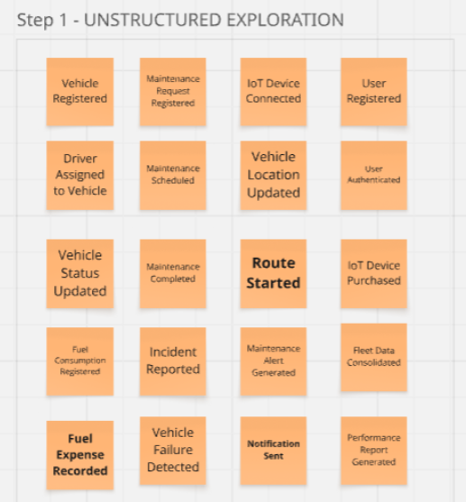
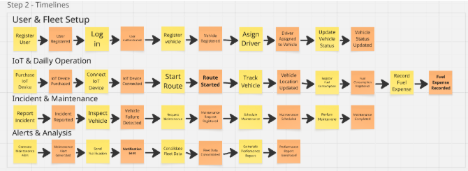
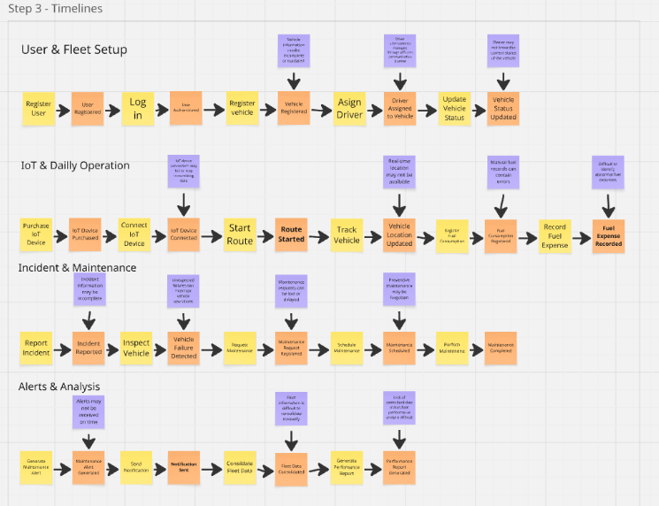

# 2.4. Big Picture EventStorming

Para iniciar el modelado de la arquitectura de **FLOTIX**, el equipo realizó una sesión de **Big Picture Event Storming**. El objetivo principal fue explorar de manera integral el dominio de la gestión de flotas, identificando los eventos significativos que ocurren durante el ciclo de vida de los vehículos y las actividades relacionadas con su operación, combustible, mantenimiento, incidencias y monitoreo.

Durante esta etapa, se utilizó una narrativa cronológica para representar los principales eventos del negocio y comprender la interacción entre los diferentes actores y procesos de FLOTIX. El equipo tomó como referencia los nueve **Bounded Contexts** identificados: *Vehicle & Fleet Management, Fuel Control, Maintenance Management, Incident Management, Real-Time Monitoring / Fleet Tracking, Alerts & Notifications, Identity, Profiles & Security, Digital Experience / IoT Commerce* y *Reporting & Analytics*.

El propósito de esta actividad no fue definir detalles técnicos, sino obtener una visión general del dominio, identificar los eventos relevantes y establecer un lenguaje común (**Ubiquitous Language**) entre los integrantes del equipo.

## Resultados y Hallazgos

A través del proceso de Big Picture EventStorming, logramos identificar los principales eventos, procesos y puntos críticos relacionados con la gestión de vehículos y flotas de transporte en FLOTIX. El análisis permitió representar el flujo de información desde el registro de los vehículos y conductores hasta el control de combustible, kilometraje, mantenimiento e incidencias.

- **Eventos del Dominio (Naranja):** Se identificaron eventos importantes como "Vehículo Registrado", "Conductor Asignado", "Combustible Registrado", "Kilometraje Actualizado", "Mantenimiento Programado", "Incidencia Reportada" y "Vehículo Disponible".

- **Puntos de Dolor (Rosado):** Se identificaron dificultades relacionadas con el registro manual de combustible y kilometraje, la falta de información centralizada sobre el estado de los vehículos, el reporte tardío de fallas y la poca visibilidad sobre el mantenimiento preventivo.

- **Hotspots (Púrpura):** Se detectaron puntos que requieren especial atención, principalmente la necesidad de contar con información actualizada mediante dispositivos IoT/GPS, alertas automáticas para mantenimiento y un historial que permita realizar seguimiento a las incidencias y gastos de cada vehículo.

---

## Paso 1: Exploración Desestructurada (Unstructured Exploration)

Esta primera fase consistió en una sesión de lluvia de ideas orientada a identificar los principales Eventos de Dominio relacionados con la gestión de flotas de FLOTIX.

El equipo identificó eventos correspondientes a las diferentes actividades realizadas por los administradores, conductores y responsables de mantenimiento, entre ellos:

- **Gestión de Vehículos:** Eventos como `Vehicle Registered`, `Vehicle Information Updated` y `Vehicle Status Updated`.

- **Gestión de Conductores:** Eventos como `Driver Registered`, `Driver Assigned to Vehicle` y `Driver Assignment Updated`.

- **Control de Combustible:** Eventos como `Fuel Consumption Registered` y `Fuel Expense Recorded`.

- **Control de Kilometraje:** Eventos como `Mileage Registered` y `Mileage Updated`.

- **Gestión de Mantenimiento:** Eventos como `Maintenance Scheduled`, `Maintenance Completed` y `Vehicle Maintenance Required`.

- **Gestión de Incidencias:** Eventos como `Vehicle Incident Reported`, `Incident Assigned` e `Incident Resolved`.

- **Monitoreo de Flota:** Eventos relacionados con la ubicación y estado del vehículo, como `Vehicle Location Updated` y `Vehicle Tracking Started`.

- **Alertas:** Identificación de eventos relacionados con alertas por mantenimiento próximo, consumo elevado de combustible o incidencias detectadas.

---

## Paso 2: Líneas de Tiempo (Timelines)

En este paso, los eventos identificados durante la exploración desestructurada fueron organizados cronológicamente para representar el flujo principal de operaciones de FLOTIX y establecer el **Happy Path**.

- **Registro y configuración inicial:** El proceso comienza con el registro del vehículo y sus datos principales, seguido por el registro y asignación del conductor correspondiente.

- **Operación del vehículo:** Durante la jornada, se registra el consumo de combustible y el kilometraje recorrido. Mediante la integración con dispositivos IoT/GPS, FLOTIX puede recibir información actualizada sobre la ubicación y el estado del vehículo.

- **Detección de necesidades de mantenimiento:** A partir del kilometraje, tiempo de uso o información registrada, se puede generar una alerta cuando el vehículo requiere mantenimiento.

- **Reporte de incidencias:** Si el conductor detecta una falla durante la operación, puede registrar una incidencia para que el administrador o responsable del mantenimiento pueda gestionarla.

- **Resolución:** La incidencia es evaluada y posteriormente se realiza el mantenimiento o reparación correspondiente, actualizando el estado del vehículo.

- **Continuidad operativa:** Una vez solucionada la incidencia y verificado el vehículo, este puede volver a estar disponible para la operación.

---

## Paso 3: Líneas de Tiempo con Puntos Críticos (Timelines with Hotspots)

En la última etapa se incorporaron los **Hotspots**, representados en color púrpura, con el objetivo de identificar puntos de dolor, riesgos y situaciones que pueden afectar la operación de la flota.

Las principales observaciones fueron:

- **Registro manual de información:** El registro de combustible y kilometraje puede depender de anotaciones manuales, aumentando el riesgo de errores y pérdida de información.

- **Falta de información en tiempo real:** Sin una integración adecuada con GPS e IoT, el administrador puede tener dificultades para conocer la ubicación y el estado actual de los vehículos.

- **Mantenimiento reactivo:** Cuando las fallas no son detectadas o reportadas oportunamente, el mantenimiento puede realizarse después de que el problema ya afecta la operación del vehículo.

- **Reporte tardío de incidencias:** La comunicación entre el conductor, administrador y taller puede generar retrasos cuando una falla no se registra inmediatamente.

- **Control del consumo de combustible:** La falta de información consolidada dificulta identificar variaciones en el consumo y controlar los gastos asociados a cada vehículo.

- **Ausencia de alertas automáticas:** Sin alertas basadas en kilometraje, tiempo o estado del vehículo, existe el riesgo de no realizar mantenimientos preventivos en el momento adecuado.

- **Trazabilidad de operaciones:** La falta de un historial centralizado de combustible, kilometraje, mantenimiento e incidencias dificulta analizar el comportamiento y evolución de cada vehículo.

- **Hotspot de integración IoT/GPS:** La incorporación de dispositivos IoT representa un punto que requiere definición técnica para garantizar que los datos del vehículo sean recibidos y actualizados correctamente en la plataforma.

Estos hallazgos permitieron identificar las principales necesidades que FLOTIX debe abordar para mejorar el **control operativo, mantenimiento preventivo, seguimiento de vehículos y gestión de recursos de la flota**.
