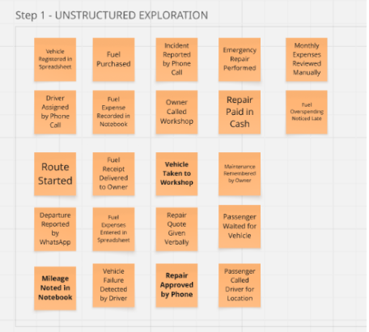
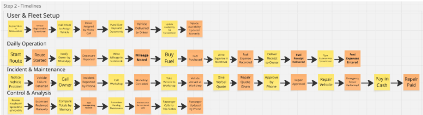
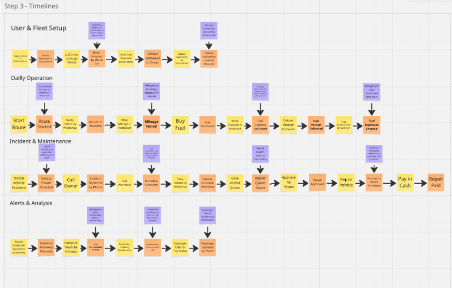

# 2.4. Big Picture EventStorming

Para iniciar el modelado de la arquitectura de FLOTIX, el equipo realizó una sesión de Big Picture Event Storming centrada en el proceso actual del negocio, sin la plataforma. El objetivo fue explorar cómo se gestionan hoy las flotas de transporte, identificando los eventos significativos que ocurren durante la operación diaria, el control de combustible y kilometraje, las incidencias y el mantenimiento, cuando se depende de hojas de cálculo, cuadernos físicos, llamadas telefónicas y mensajería instantánea.

Se utilizó una narrativa cronológica para representar los eventos del negocio y entender la interacción entre los actores involucrados: el dueño o administrador, el conductor, el taller mecánico y el pasajero. El propósito no fue definir detalles técnicos, sino obtener una visión general del dominio, identificar los puntos críticos del proceso actual y establecer un lenguaje común (Ubiquitous Language) entre los integrantes del equipo.

El propósito de esta actividad no fue definir detalles técnicos, sino obtener una visión general del dominio, identificar los eventos relevantes y establecer un lenguaje común (**Ubiquitous Language**) entre los integrantes del equipo.

## Resultados y Hallazgos

A través del proceso de Big Picture EventStorming, logramos identificar los principales eventos, procesos y puntos críticos relacionados con la gestión de vehículos y flotas de transporte en FLOTIX. El análisis permitió representar el flujo de información desde el registro de los vehículos y conductores hasta el control de combustible, kilometraje, mantenimiento e incidencias.

- **Eventos del Dominio (Naranja):** se identificaron 22 eventos, entre ellos Vehicle Registered in Spreadsheet, Driver Assigned by Phone Call, Fuel Expense Recorded in Notebook, Incident Reported by Phone Call, Repair Quote Given Verbally y Emergency Repair Performed.
- **Puntos de Dolor (Rosado):** registro manual de combustible y kilometraje, ausencia de información centralizada sobre el estado de los vehículos, reporte tardío de fallas, cotizaciones y aprobaciones sin respaldo y mantenimiento que depende de la memoria del dueño.
- **Hotspots (Púrpura):** falta de ubicación y visibilidad en tiempo real, imposibilidad de verificar el consumo real de combustible, ausencia de historial del vehículo y detección tardía de sobrecostos.

---

## Paso 1: Exploración Desestructurada (Unstructured Exploration)

Esta primera fase consistió en una lluvia de ideas para identificar los Eventos de Dominio del proceso actual. El equipo identificó 22 eventos, agrupados por actividad:

- **Registro y asignación:** Vehicle Registered in Spreadsheet, Driver Assigned by Phone Call.
- **Operación diaria:** Route Started, Departure Reported by WhatsApp, Mileage Noted in Notebook.
- **Combustible:** Fuel Purchased, Fuel Expense Recorded in Notebook, Fuel Receipt Delivered to Owner, Fuel Expenses Entered in Spreadsheet.
- **Incidencias:** Vehicle Failure Detected by Driver, Incident Reported by Phone Call.
- **Mantenimiento:** Owner Called Workshop, Vehicle Taken to Workshop, Repair Quote Given Verbally, Repair Approved by Phone, Emergency Repair Performed, Repair Paid in Cash, Maintenance Remembered by Owner.
- **Pasajero:** Passenger Waited for Vehicle, Passenger Called Driver for Location.
- **Control:** Monthly Expenses Reviewed Manually, Fuel Overspending Noticed Late.

---

## Paso 2: Líneas de Tiempo (Timelines)

Los eventos fueron organizados cronológicamente para representar el flujo actual de operaciones, en cuatro carriles:

- **Registro y configuración inicial:** el dueño registra el vehículo en una hoja de cálculo (Vehicle Registered in Spreadsheet) y asigna al conductor mediante una llamada (Driver Assigned by Phone Call).
- **Operación diaria:** el conductor inicia la ruta (Route Started) y avisa por WhatsApp (Departure Reported by WhatsApp). Anota el kilometraje en un cuaderno (Mileage Noted in Notebook), compra combustible (Fuel Purchased), registra el gasto (Fuel Expense Recorded in Notebook) y entrega el comprobante al dueño (Fuel Receipt Delivered to Owner), quien lo digita en la hoja de cálculo (Fuel Expenses Entered in Spreadsheet). Mientras tanto, el pasajero espera sin información (Passenger Waited for Vehicle) y llama al conductor para saber dónde está (Passenger Called Driver for Location).
- **Incidencias y mantenimiento:** el conductor detecta una falla (Vehicle Failure Detected by Driver) y la reporta por teléfono (Incident Reported by Phone Call). El dueño llama al taller (Owner Called Workshop), el vehículo es llevado (Vehicle Taken to Workshop) y el taller da una cotización verbal (Repair Quote Given Verbally), que el dueño aprueba por teléfono (Repair Approved by Phone). Se realiza la reparación de emergencia (Emergency Repair Performed) y se paga en efectivo (Repair Paid in Cash).
- **Control y análisis:** el dueño revisa manualmente los gastos del mes (Monthly Expenses Reviewed Manually), nota tarde el sobrecosto (Fuel Overspending Noticed Late) y recuerda un mantenimiento pendiente solo por memoria (Maintenance Remembered by Owner).

---

## Paso 3: Líneas de Tiempo con Puntos Críticos (Timelines with Hotspots)

En la última etapa se incorporaron los Hotspots (púrpura) para identificar los puntos de dolor y riesgos del proceso actual:

- **Estado de la flota desconocido:** la hoja de cálculo no refleja el estado real de cada unidad (Vehicle Registered in Spreadsheet).
- **Asignación sin trazabilidad:** depende de llamadas y no queda registro de quién usó cada vehículo (Driver Assigned by Phone Call).
- **Sin ubicación en tiempo real:** el dueño depende de avisos por WhatsApp (Departure Reported by WhatsApp).
- **Kilometraje poco confiable:** puede olvidarse, errarse o alterarse (Mileage Noted in Notebook).
- **Combustible sin verificación:** no se puede comprobar el consumo real ni detectar pérdidas (Fuel Expense Recorded in Notebook).
- **Doble digitación y pérdida de comprobantes:** aumenta el riesgo de errores (Fuel Expenses Entered in Spreadsheet).
- **Fallas detectadas tarde:** el problema se nota cuando el vehículo ya falló (Vehicle Failure Detected by Driver).
- **Coordinación lenta con el taller:** no hay historial del vehículo para el mecánico (Owner Called Workshop).
- **Cotizaciones verbales:** no hay evidencia ni trazabilidad (Repair Quote Given Verbally).
- **Mantenimiento correctivo de emergencia:** es más costoso que el preventivo (Emergency Repair Performed).
- **Mantenimiento por memoria:** el preventivo no se programa a tiempo (Maintenance Remembered by Owner).
- **Pasajero sin información confiable:** debe llamar para saber dónde está su vehículo (Passenger Called Driver for Location).
- **Sobrecostos detectados semanas después:** la revisión es manual y tardía (Fuel Overspending Noticed Late).

Estos hallazgos evidencian las necesidades que FLOTIX debe abordar: centralizar la información de la flota, automatizar el registro de combustible y kilometraje mediante IoT/GPS, habilitar alertas de mantenimiento preventivo y mantener un historial trazable de cada vehículo.

Estos hallazgos permitieron identificar las principales necesidades que FLOTIX debe abordar para mejorar el **control operativo, mantenimiento preventivo, seguimiento de vehículos y gestión de recursos de la flota**.
