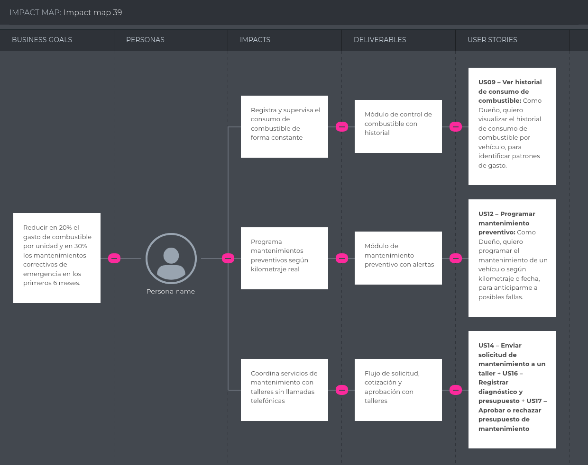
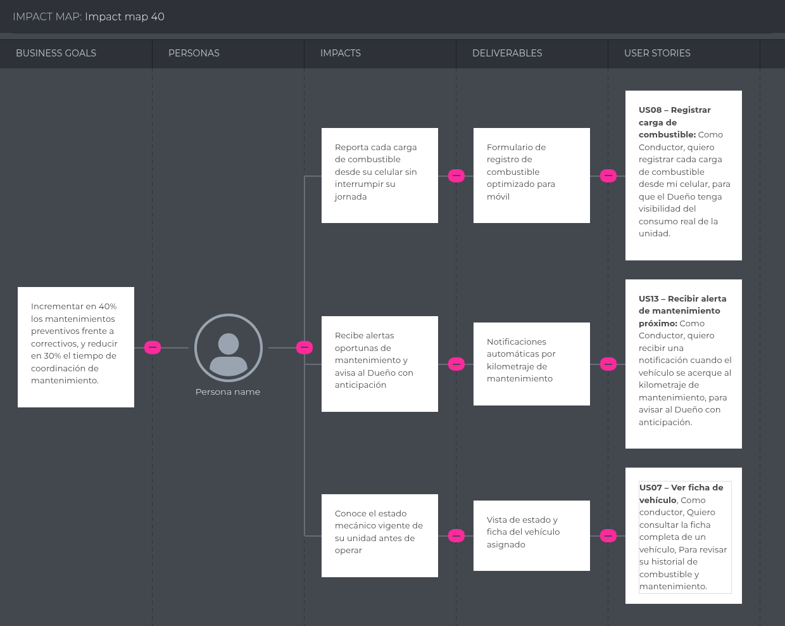
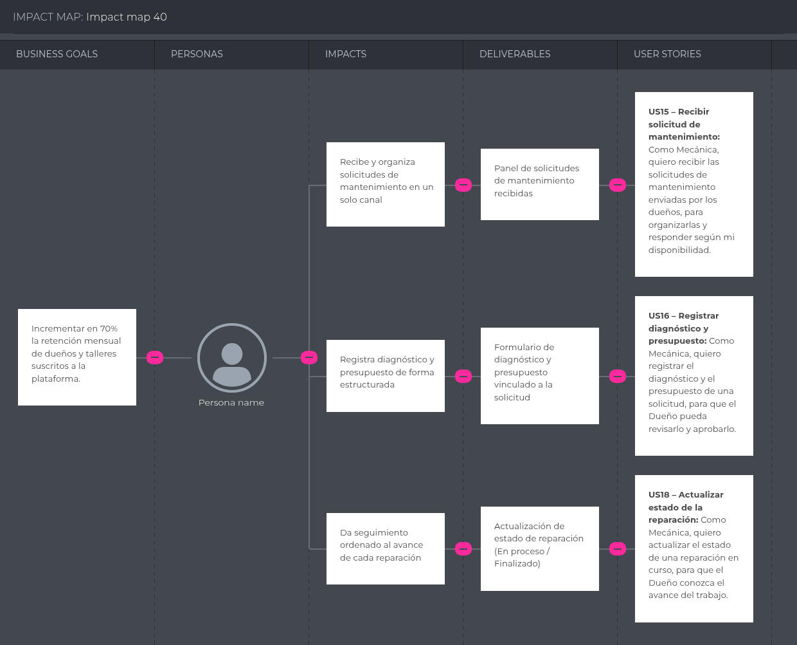

## 3.2. Impact Mapping

El Impact Mapping es una herramienta de planificación estratégica que nos permite conectar los objetivos de negocio de Flotix con los comportamientos de cada segmento objetivo.

### Impact Map - Segmento 1: Dueño

### Impact Map - Segmento 2: Conductor

### Impact Map – Segmento 3: Mecánica

