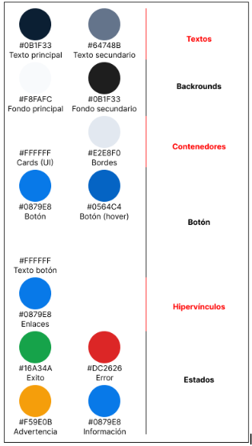

# Capítulo IV: Product Design

## 4.1. Style Guidelines

### 4.1.1. General Style Guidelines

**Identidad visual**

Como Developer Team deseamos construir a Flotix con una identidad que inspire confianza, tecnología y eficiencia. Nuestra Aplicación está dirigida a operadoras logísticas de transporte por lo cual nuestra interfaz busca transmitir que se está utilizando una herramienta profesional. Además el diseño considerará que los nuevos usuarios vienen de trabajar con herramientas como hojas de cálculo o cuadernos, por lo tanto priorizamos una interfaz sencilla de entender y con patrones de diseño que integren su conocimiento en aplicaciones web como whatsapp o facebook.

**Principios de diseño**

**Relación entre el sistema y el mundo real**

Se incluye el lenguaje familiar en la administración de flotas.

**Consistencia y estándares**

Se usan estándares en el diseño de interfaces gráficas presentes en aplicaciones populares como redes sociales.

**Estética y diseño minimalista**

Al tratarse de una herramienta de trabajo que pretende reemplazar procesos que ya se realizan de forma manual, se dispone una interfaz sencilla de entender, incluyendo únicamente los elementos necesarios para cada pantalla.

**Mapas de calor (UX)**

Aprovecha el uso de colores resaltantes, botones de confirmación y formularios simples para facilitar la navegación y funcionamiento de las pantallas.

- Colores

- **Azul marino #0B1F33:** Aporta confianza, estabilidad y profesionalismo y contraste con colores azulados claros y blanco.

- **Azul Flotix #0879E8:** Representa tecnología, conectividad y dinamismo, es el color principal de interacción con la plataforma además funciona como identidad visual de Flotix.

- **Gris claro #F8FAFC y Blanco #FFFFFF:** Aportan limpieza, simplicidad y claridad. Sirven como contraste y descanso visual para destacar a los elementos principales.

### 4.1.2. Web Style Guidelines

**1. Diseño y estructura**

La interfaz de Flotix sigue una estructura basada en paneles de control (dashboard), orientada a facilitar la gestión y supervisión de las operaciones de una flota.

- Se utiliza una barra lateral para la navegación principal.

- El contenido se organiza en una zona central jerárquica.

- Se utilizan cards para agrupar información relacionada.

- Los indicadores principales se presentan en la parte superior del dashboard.

- Las alertas y situaciones que requieren atención se destacan visualmente.

La estructura puede incluir módulos como:

- Dashboard.

- Vehículos.

- Conductores.

- Combustible.

- Mantenimiento.

- Monitoreo GPS.

- Talleres.

- Reportes.

- Configuración.

Justificación: Esta estructura permite centralizar la información de la flota y facilita que el administrador pueda identificar rápidamente el estado de sus vehículos y las situaciones que requieren atención.

**2. Sistema de grillas**

- Se utiliza un sistema de grilla basado en 12 columnas.

- El espaciado se basa principalmente en múltiplos de 8 px.

- Los contenedores se adaptan de manera responsiva a diferentes resoluciones.

- Las cards se reorganizan según el tamaño de pantalla.

- Se mantiene una separación visual consistente entre los componentes.

Justificación: El sistema de grillas permite distribuir de forma ordenada los diferentes indicadores, tablas, formularios y elementos de monitoreo, manteniendo la consistencia visual en toda la aplicación.

**3. Componentes UI principales**

**Tablas**

Las tablas se utilizan para presentar información detallada relacionada con:

- Vehículos.

- Conductores.

- Registros de combustible.

- Mantenimientos.

- Incidencias.

- Solicitudes a talleres.

Incluyen:

- Paginación.

- Filtros.

- Ordenamiento.

- Búsqueda.

Justificación: Permiten administrar grandes cantidades de información de manera organizada y facilitar la consulta de datos específicos.

**Cards**

Las cards se utilizan para presentar información resumida y agrupada.

Ejemplos:

- Vehículos activos.

- Vehículos en mantenimiento.

- Consumo de combustible.

- Próximos mantenimientos.

- Alertas.

- Indicadores de rendimiento.

Justificación: Las cards permiten dividir la información en bloques fácilmente identificables y facilitan la lectura rápida del dashboard.

**Botones**

Se utilizan diferentes tipos de botones de acuerdo con la importancia de cada acción:

- Primario: Registrar vehículo, guardar cambios, programar mantenimiento.

- Secundario: Cancelar, volver, consultar detalles.

- Peligro: Eliminar vehículo, cancelar una solicitud o rechazar una operación.

Estados:

- Hover.

- Activo.

- Deshabilitado.

- Cargando.

Justificación: La diferenciación visual permite reconocer rápidamente las acciones disponibles y reduce la posibilidad de errores.

**Insignias (etiquetas de estado)**

Se utilizan etiquetas para identificar visualmente el estado de los elementos de la plataforma.

Ejemplos:

- Disponible.

- En ruta.

- En mantenimiento.

- Fuera de servicio.

- Pendiente.

- Completado.

- Urgente.

Justificación: Permiten reconocer rápidamente el estado de una unidad o proceso sin necesidad de revisar información adicional.

**Formularios**

Los formularios se utilizan para registrar y actualizar información relacionada con:

- Vehículos.

- Conductores.

- Combustible.

- Mantenimientos.

- Talleres.

- Incidencias.

Características:

- Etiquetas visibles.

- Campos claramente identificados.

- Validaciones en tiempo real.

- Identificación de campos obligatorios.

- Mensajes de error específicos.

Ejemplo:

**“El kilometraje es obligatorio.”**

Justificación: Los formularios simples y claros reducen errores y facilitan el registro de información por parte de los usuarios.

**Notificaciones**

Las notificaciones permiten comunicar al usuario diferentes eventos generados por la plataforma. Se utilizan para:

- Confirmar registros.

- Informar sobre mantenimientos próximos.

- Alertar sobre consumos anómalos.

- Informar sobre incidencias.

- Comunicar errores.

- Notificar solicitudes de mantenimiento.

Tipos:

- Toast o mensajes flotantes.

- Alertas dentro de la interfaz.

- Indicadores de notificación.

**4. Interacción (UX Behavior)**

**Feedback inmediato**

El sistema proporciona retroalimentación inmediata después de cada acción realizada.

Ejemplos:

- “Vehículo registrado correctamente.”

- “Mantenimiento programado correctamente.”

- “Registro de combustible guardado.”

- “Solicitud enviada al taller.”

- “Error al completar el formulario.”

Justificación: El feedback inmediato reduce la incertidumbre del usuario y confirma el resultado de sus acciones.

**Restricciones de acciones**

El sistema restringe determinadas acciones cuando no se cumplen las condiciones necesarias.

Ejemplos:

- No se puede asignar un vehículo que se encuentre fuera de servicio.

- No se puede finalizar un mantenimiento que aún está pendiente.

- No se puede registrar una incidencia sin seleccionar un vehículo.

- No se puede programar un mantenimiento sin registrar el kilometraje requerido.

**Visualización de estado**

Los estados del sistema se representan mediante:

- Colores.

- Iconos.

- Insignias.

- Indicadores.

- Alertas.

Esto permite diferenciar rápidamente situaciones normales de aquellas que requieren atención.

**5. Diseño adaptable (Responsive Design)**

Flotix está diseñado para ser accesible desde:

- Escritorio.

- Tableta.

- Smartphone.

**Escritorio**

- Barra lateral visible.

- Dashboard con múltiples indicadores.

- Tablas completas.

- Visualización amplia de gráficos y métricas.

**Tableta**

- Barra lateral adaptable.

- Cards reorganizadas.

- Formularios ajustados al tamaño de pantalla.

- Tablas con desplazamiento horizontal cuando sea necesario.

**Móvil**

- Barra lateral plegable.

- Cards organizadas verticalmente.

- Tablas adaptadas a cards o desplazamiento horizontal.

- Botones con tamaño adecuado para interacción táctil.

- Priorización de acciones principales.

En el caso de los conductores, la versión móvil prioriza funcionalidades como:

- Registro de combustible.

- Reporte de incidencias.

- Consulta de alertas.

- Consulta del estado del vehículo.

Justificación: Los administradores pueden utilizar principalmente la plataforma desde computadoras, mientras que los conductores requieren acceso desde smartphones durante su jornada.

**6. Navegación**

La navegación de Flotix está organizada de manera jerárquica para facilitar el acceso a las funcionalidades principales.

- Barra lateral persistente en escritorio.

- Barra lateral plegable en dispositivos móviles.

- Menú organizado por módulos.

- Migas de pan para indicar la ubicación actual cuando sea necesario.

La navegación principal contempla:

- Dashboard.

- Vehículos.

- Conductores.

- Combustible.

- Mantenimiento.

- Monitoreo GPS.

- Talleres.

- Reportes.

- Configuración.

Justificación: Una navegación clara y consistente permite que cada usuario encuentre rápidamente las funcionalidades relacionadas con su rol.

**7. Iconografía**

Se utilizan iconos simples, universales y consistentes para facilitar la identificación de las funcionalidades.

Ejemplos:

- Vehículos: icono de automóvil.

- GPS: icono de ubicación.

- Combustible: icono de surtidor.

- Mantenimiento: icono de herramienta.

- Conductores: icono de usuario.

- Talleres: icono de establecimiento.

- Alertas: icono de advertencia.

- Reportes: icono de gráfico.

- Configuración: icono de engranaje.

Los iconos se utilizan como complemento del texto y mantienen un estilo visual uniforme en toda la plataforma.

Justificación: Una iconografía consistente permite identificar rápidamente las funcionalidades y reduce el esfuerzo necesario para navegar por la plataforma.