## 4.4. Web Applications UX/UI Design

### 4.4.1. Web Applications Wireframes

> **Figura 4.4.1.** Wireframes de baja fidelidad de la Web Application (Dashboard, Vehículos, Conductores, Combustible, Mantenimiento, Monitoreo GPS, Talleres, Reportes).

> 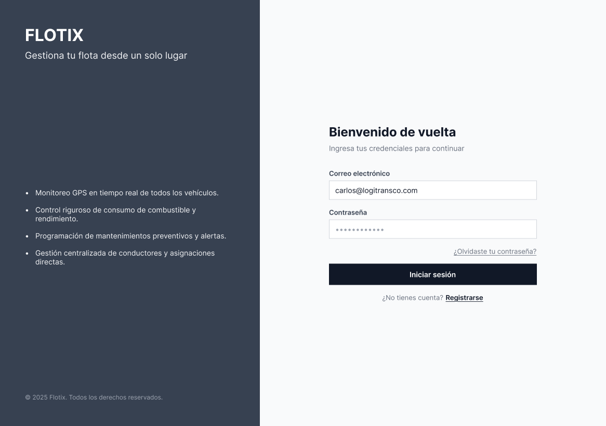
> 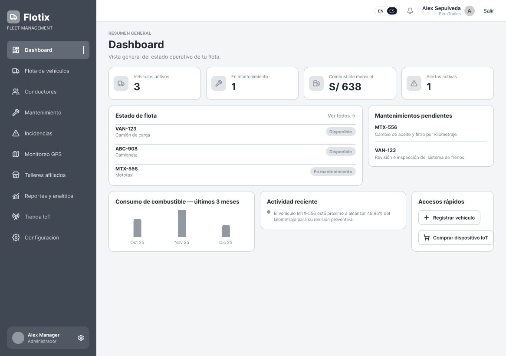
> 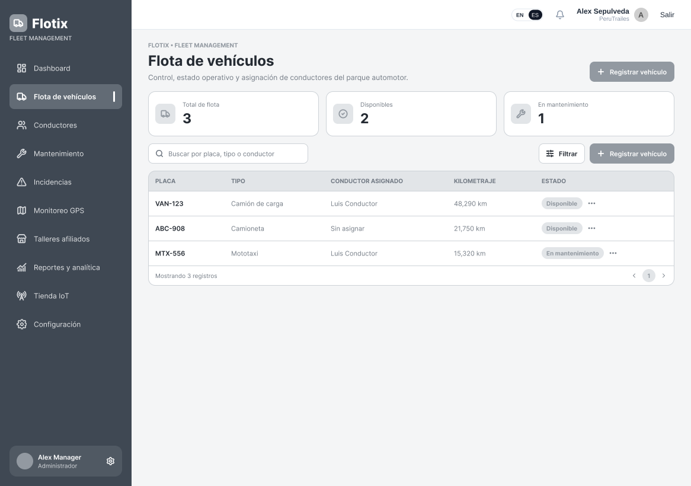
> 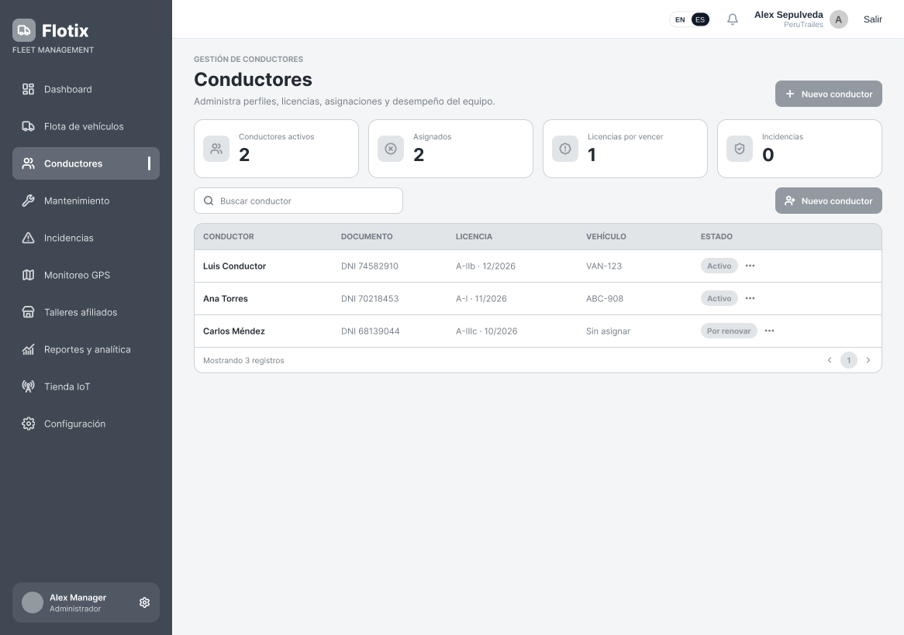
> 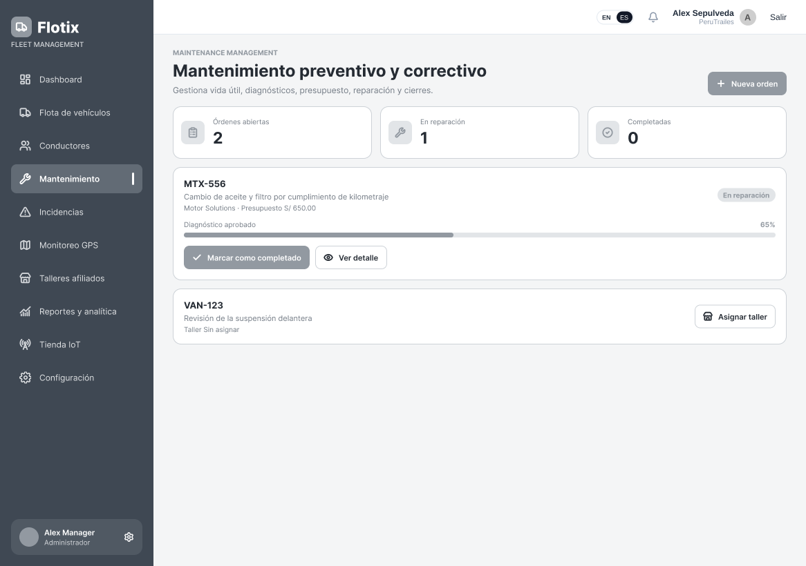
> 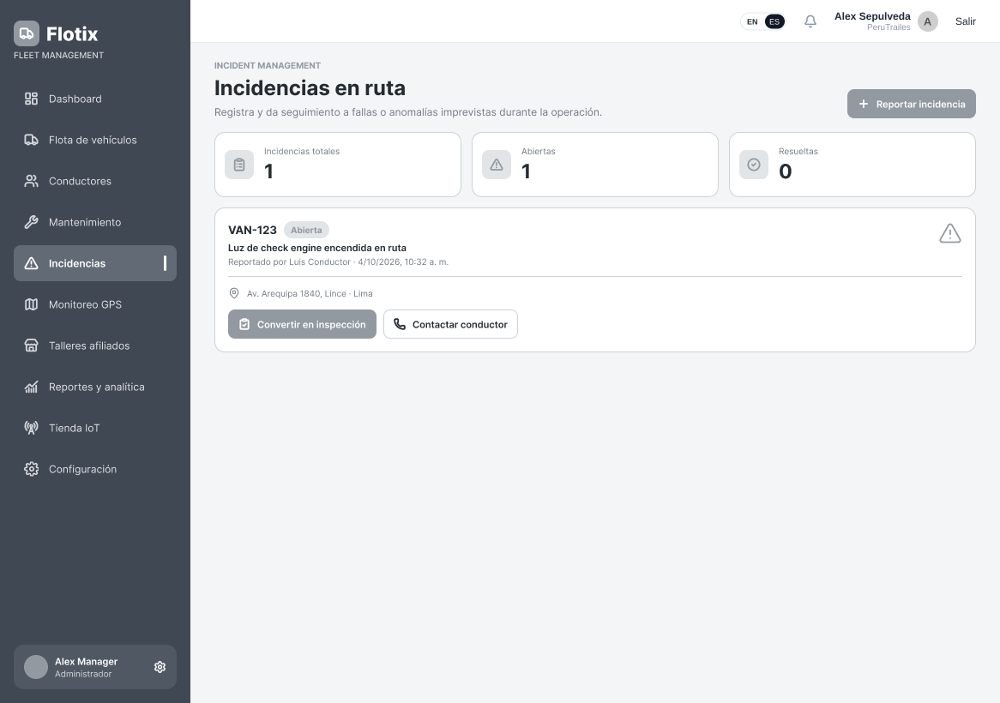
> 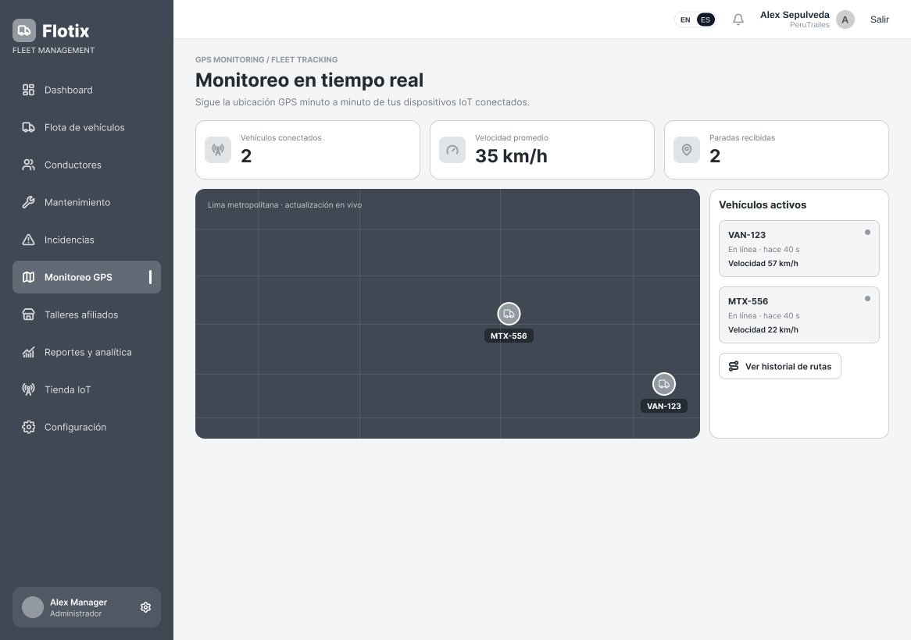
> 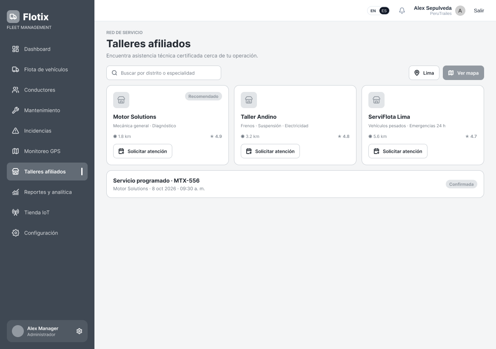
> 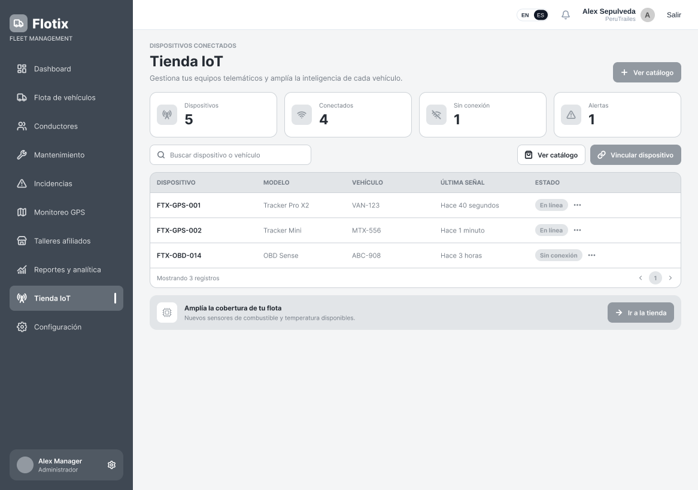
> 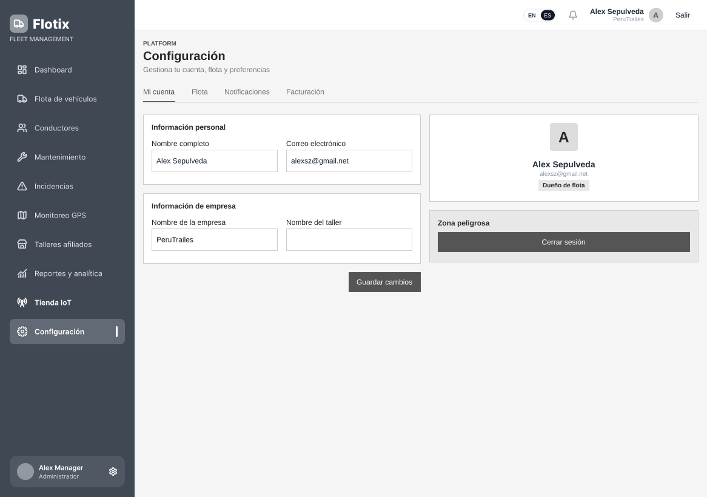

### 4.4.2. Web Applications Wireflow Diagrams

> **Figura 4.4.2a.** Wireflow diagrams de la Web Application.

> 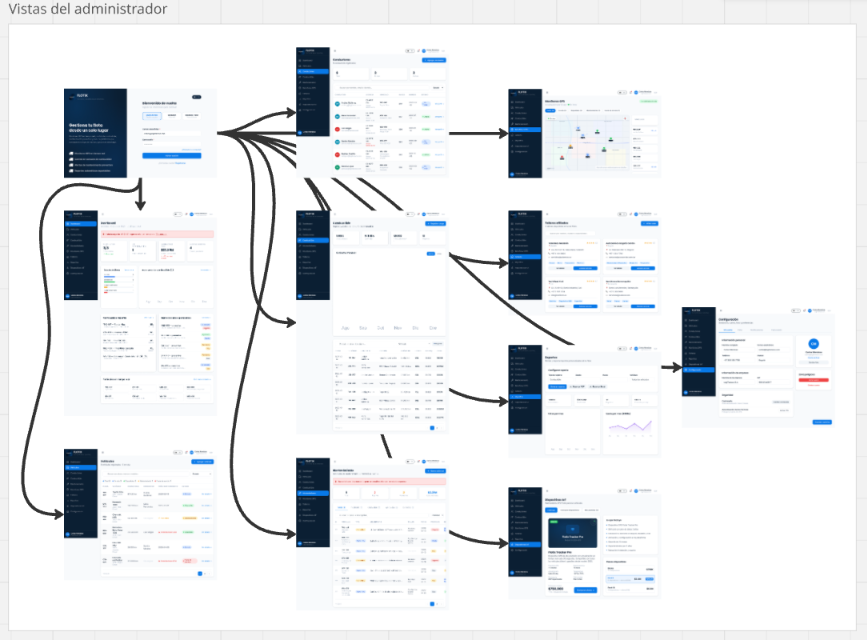

> 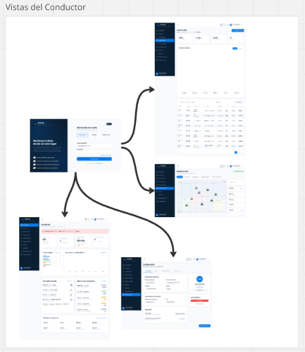

> 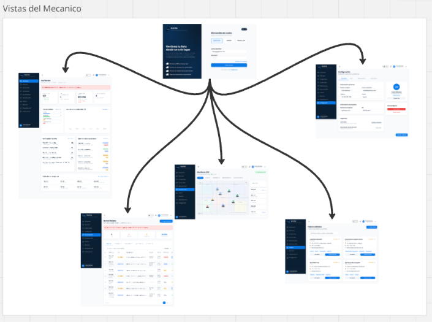

### 4.4.2. Web Applications Mock-ups

> **Figura 4.4.2b.** Mock-ups de alta fidelidad de la Web Application.

> 
> 
> 
> 
> 
> 
> 
> 
> 
> 

### 4.4.3. Web Applications User Flow Diagrams

Se definieron los siguientes flujos de usuario (User Flows) para el rol Administrador:

**Goal 1 — Inicio de sesión**

Como administrador, quiero iniciar sesión en FLOTIX, para acceder de manera segura a la información de la flota.

**Goal 2 — Visualizar estado de flota**

Como administrador, quiero visualizar el estado de los choferes, para conocer cómo se encuentra la operación de la flota.

**Goal 3 — Monitorear flota GPS**

Como administrador, quiero visualizar la ubicación de los vehículos, para supervisar sus recorridos y conocer su estado durante las operaciones.

**Goal 4 — Consultar talleres afiliados**

Como administrador, quiero consultar talleres disponibles, para gestionar servicios de mantenimiento para la flota.

> **Figura 4.4.3.** User Flow Diagrams de los cuatro objetivos anteriores.

> 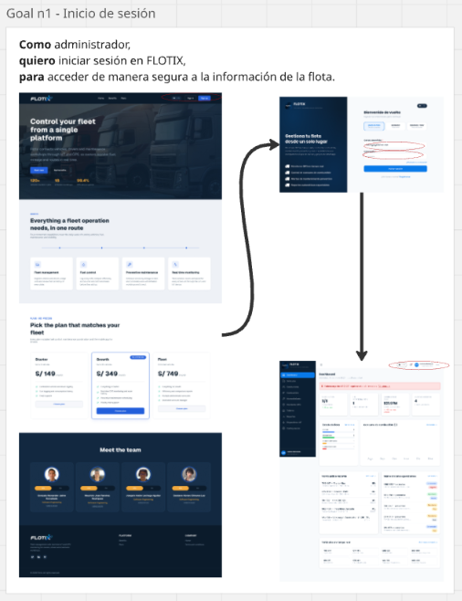

> 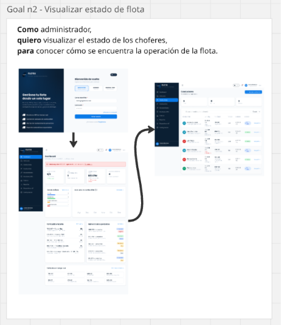

> 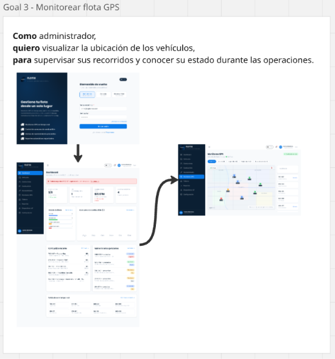

> 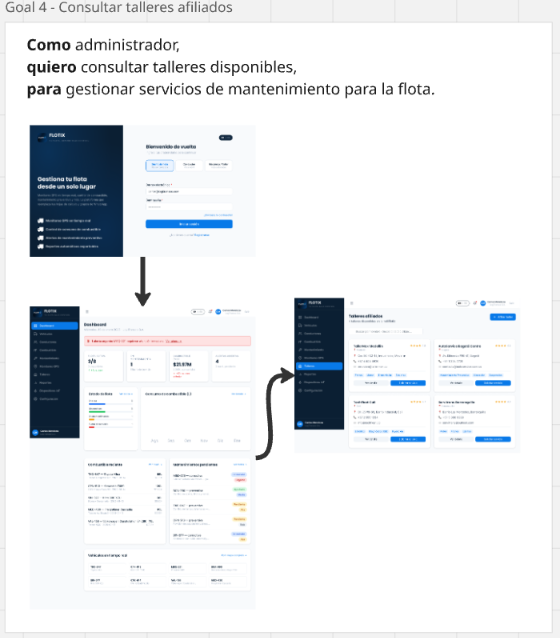