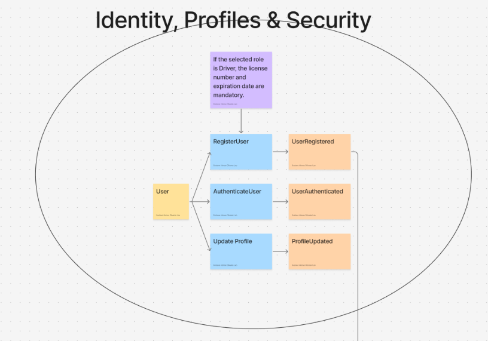
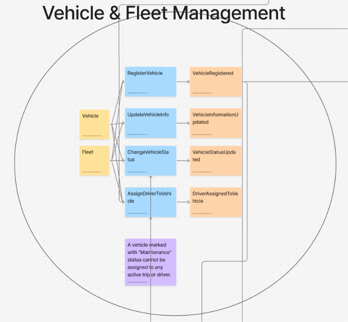
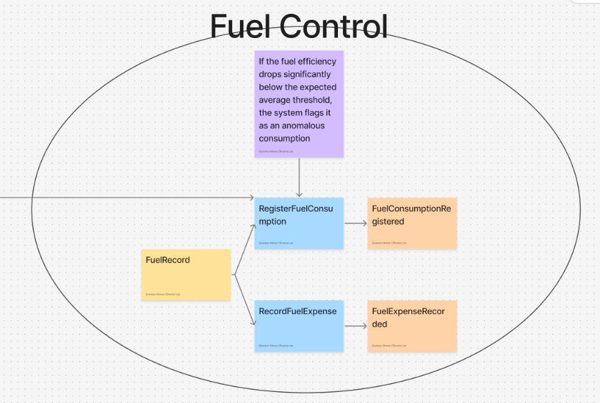
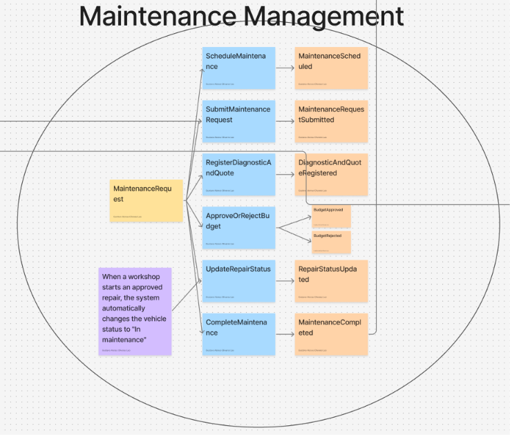
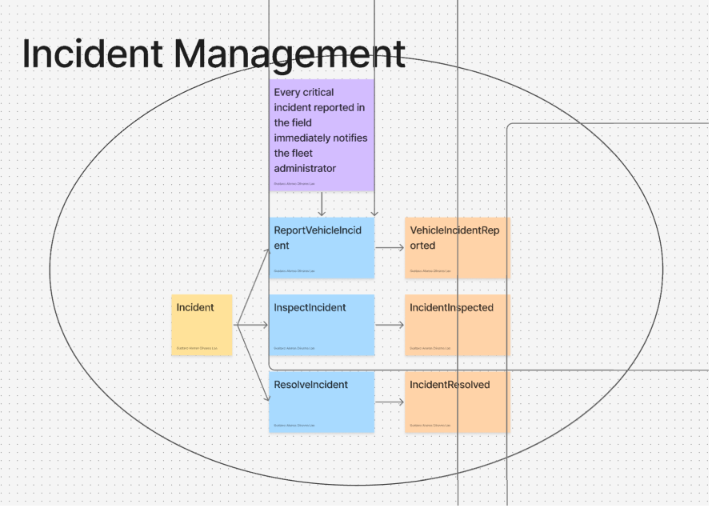
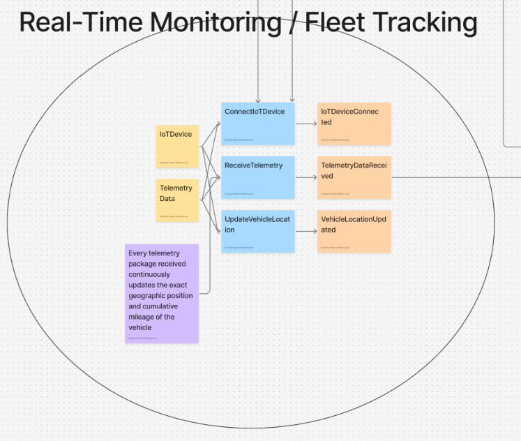
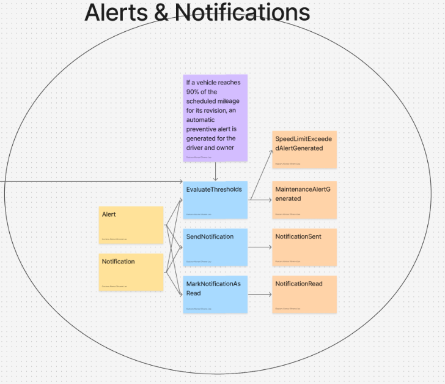
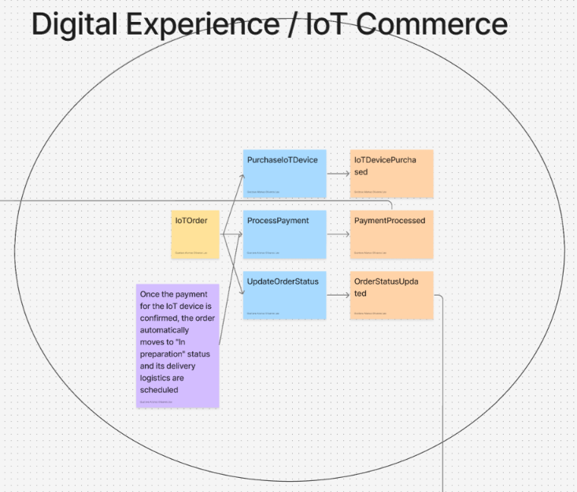
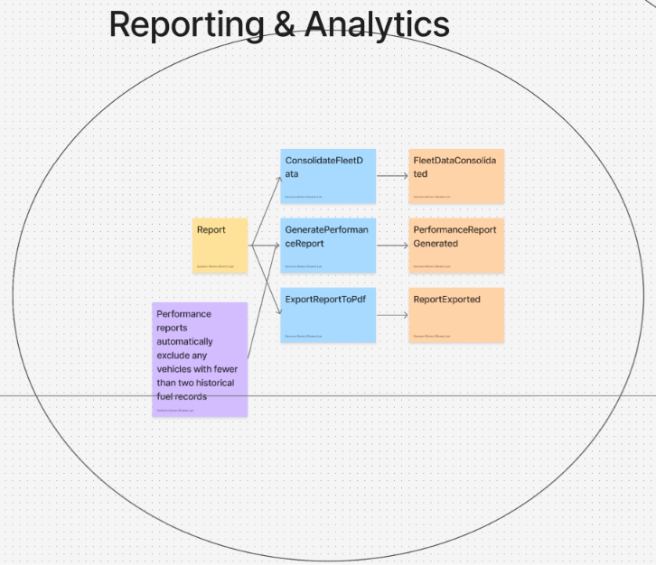

## 4.6. Domain-Driven Software Architecture

### 4.6.1. Design-Level EventStorming

**General**

En esta vista general se representó el dominio completo del sistema Flotix, organizando los procesos en distintos Bounded Contexts. Se identificaron las áreas principales del negocio y la interacción entre ellas mediante eventos de dominio. Los contextos definidos fueron:

- Identity, Profiles & Security

- Vehicle & Fleet Management

- Fuel Control

- Maintenance Management

- Incident Management

- Real-Time Monitoring / Fleet Tracking

- Alerts & Notifications

- Digital Experience / IoT Commerce

- Reporting & Analytics

Esta representación permite visualizar cómo fluye la información entre los diferentes módulos: desde el registro de usuarios y la gestión de la flota de vehículos, pasando por el control de combustible, la coordinación de mantenimientos y el monitoreo GPS en tiempo real, hasta la generación de alertas, la adquisición de hardware telemático y la analítica gerencial. Asimismo, se establecieron las integraciones inter-contexto, donde los eventos de un módulo (como el registro de un vehículo o la finalización de un mantenimiento) actúan como disparadores para las operaciones de los demás contextos.

> 

**Identity, Profiles & Security**

Este bounded context se encarga de administrar la base de usuarios y los accesos diferenciados para el funcionamiento de la plataforma Flotix. Su propósito principal es gestionar la identidad de los actores del sistema (Dueño, Conductor, Mecánica) garantizando la seguridad y el control de accesos mediante autenticación basada en roles. El flujo inicia con el registro de la cuenta (RegisterUser), donde el usuario selecciona su rol y el sistema valida sus credenciales. Durante este proceso, se aplican políticas de negocio específicas, tales como exigir obligatoriamente el número de licencia y la fecha de expiración en caso de que el rol seleccionado sea Conductor. Una vez autenticado (AuthenticateUser), el usuario puede actualizar su perfil de manera segura, asegurando que cada actor interactúe únicamente con las funcionalidades permitidas según sus responsabilidades operativas.

> 

**Vehicle & Fleet Management**

Este bounded context representa el núcleo operativo de la plataforma, ya que gestiona el parque automotor y la administración centralizada de la flota de transporte. El flujo inicia cuando el propietario registra un nuevo vehículo (RegisterVehicle) ingresando datos clave como placa, tipo y kilometraje inicial. Posteriormente, el sistema permite actualizar su información técnica (UpdateVehicleInfo), consultar el estado operativo (ChangeVehicleStatus) y realizar la asignación de conductores habilitados (AssignDriverToVehicle). Este módulo se integra directamente con el contexto de seguridad al consumir el evento de registro de conductores, asegurando que solo personal autorizado opere las unidades.

> 

**Fuel Control**

Este bounded context se encarga de registrar y auditar el consumo de combustible y el rendimiento por unidad dentro de la flota. El flujo contempla el registro detallado de cada recarga realizada por el conductor (RegisterFuelConsumption), ingresando los litros cargados, el costo asociado y el kilometraje actual en el odómetro. El sistema procesa estos datos de forma constante y aplica reglas de negocio para calcular la eficiencia; si el rendimiento se desvía significativamente por debajo del promedio esperado, el sistema lo cataloga automáticamente como un consumo anómalo. Asimismo, permite registrar los gastos financieros asociados al reabastecimiento (RecordFuelExpense).

> 

**Maintenance Management**

Este bounded context gestiona el ciclo de vida completo de los servicios mecánicos preventivos y correctivos de las unidades. El flujo abarca desde la programación de mantenimientos (ScheduleMaintenance) y el envío de solicitudes de servicio (SubmitMaintenanceRequest), hasta el registro de diagnósticos y cotizaciones por parte del taller mecánico afiliar (RegisterDiagnosticAndQuote). Posteriormente, el propietario evalúa y aprueba o rechaza el presupuesto (ApproveOrRejectBudget). Una vez iniciada la reparación, se actualiza el estado del taller (UpdateRepairStatus), lo cual activa una política de negocio automática que cambia el estado del vehículo a "En mantenimiento" para evitar asignaciones en ruta. Finalmente, el proceso culmina al registrar la finalización del servicio (CompleteMaintenance).

> 

**Incident Management**

Este bounded context se enfoca en registrar y dar seguimiento a las fallas o anomalías imprevistas presentadas durante la jornada laboral en ruta. El flujo permite que el conductor reporte incidencias mecánicas o operativas de forma inmediata (ReportVehicleIncident), lo cual activa notificaciones críticas automáticas hacia los administradores. Posteriormente, el equipo de soporte procede a inspeccionar el caso (InspectIncident) y documentar su resolución (ResolveIncident), asegurando una pronta intervención para restablecer la continuidad operativa de la flota.

> 

**Real-Time Monitoring / Fleet Tracking**

Este bounded context gestiona la telemetría en tiempo real y el rastreo satelital de los vehículos mediante dispositivos IoT. El flujo contempla la conexión del dispositivo físico a la unidad (ConnectIoTDevice), permitiendo la recepción continua de paquetes de telemetría (ReceiveTelemetry) que incluyen coordenadas GPS, velocidad y odómetro. A partir de estos datos, el sistema actualiza de manera constante la posición geográfica en el mapa (UpdateVehicleLocation), alimentando a su vez los módulos de alertas y control de rendimiento.

> 

**Alerts & Notifications**

Este bounded context monitorea de forma continua las condiciones críticas de la operación y gestiona la mensajería interna para los usuarios. El sistema evalúa constantemente los umbrales operativos (EvaluateThresholds) —tales como el cumplimiento del 90% del kilometraje para revisiones o excesos de velocidad reportados por el telemetraje—. Cuando se detecta una condición fuera de rango, se generan alertas automáticas (MaintenanceAlertGenerated, SpeedLimitExceededAlertGenerated), se despachan notificaciones oportunas a los involucrados (SendNotification) y se gestiona el estado de lectura de las mismas (MarkNotificationAsRead).

> 

**Digital Experience / IoT Commerce**

Este bounded context soporta el módulo de comercio electrónico orientado a la adquisición de hardware telemático por parte de los propietarios. El flujo permite comprar dispositivos IoT de manera directa (PurchaseIoTDevice), procesar el pago correspondiente a través de pasarelas integradas (ProcessPayment) y actualizar el estado del pedido (UpdateOrderStatus). Una vez confirmado el pago, una regla de negocio automatizada cambia el pedido a estado "En preparación" y programa su logística de entrega para su posterior integración a la flota.

> 

**Reporting & Analytics**

Este bounded context consolida los datos operativos e históricos de la plataforma para la generación de reportes gerenciales e indicadores de eficiencia. El flujo permite consolidar los datos de toda la flota (ConsolidateFleetData), generar informes comparativos de rendimiento y consumo (GeneratePerformanceReport) aplicando reglas de filtrado (como la exclusión automática de vehículos con menos de dos registros históricos de combustible), y exportar los resultados en formato documentario (ExportReportToPdf) para apoyar la toma de decisiones estratégicas de los administradores.

> 

### 4.6.2. Software Architecture Context Diagram

> **Figura 4.6.2.** Diagrama de Contexto (C4 Model) — Flotix Platform y sus interacciones externas.

> .png)

El Context Diagram es el nivel más alto de abstracción del C4 Model. Su objetivo es mostrar a Flotix como una “caja negra” en el centro del ecosistema, identificando los actores que interactúan con el sistema y los sistemas externos con los que se integra, sin detallar aún su arquitectura interna o tecnología. El diagrama fue elaborado en Structurizr siguiendo la notación estándar del C4 Model.

**Actores**

Owner (Dueño):

Es el actor central de la gestión administrativa. Administra la flota de vehículos, aprueba presupuestos de mantenimiento, revisa métricas operativas y de combustible, y adquiere hardware telemático.

**Driver (Conductor):**

Operador de las unidades móviles en campo. Se encarga de conducir el vehículo, registrar las cargas de combustible y reportar incidencias operativas o mecánicas de forma inmediata.

Mechanic (Mecánica):

Talleres o mecánicos afiliados a la plataforma. Su interacción consiste en recibir solicitudes de servicio, emitir diagnósticos técnicos, registrar cotizaciones y actualizar el estado de las reparaciones.

**Sistemas externos**

Email System:

Servicio externo (ej. SendGrid) que provee infraestructura SMTP para el envío automatizado de notificaciones del sistema, alertas críticas y procesos de recuperación de cuentas.

Payment Gateway:

Proveedor externo (ej. Stripe / Culqi) que procesa pagos de forma segura mediante tarjetas de crédito, débito y transferencias para la adquisición de dispositivos IoT. Permite a Flotix evitar el manejo directo de datos financieros sensibles, cumpliendo con estándares de seguridad como PCI-DSS.

IoT Device:

Dispositivos físicos de hardware instalados en los vehículos (GPS, odómetros y sensores de combustible) que envían paquetes de telemetría en tiempo real a la plataforma para el monitoreo de la flota.

**Interacciones principales**

El sistema presenta tres tipos de flujos de información:

- Flujos operativos: Interacción entre los actores humanos (dueños, conductores y mecánicos) y Flotix para la gestión de vehículos, registro de combustible, coordinación de mantenimientos y reporte de incidencias.

- Flujos hacia servicios externos: Solicitudes de envío de correos electrónicos y procesamiento de transacciones financieras hacia la pasarela de pagos.

- Flujos de datos externos: Ingesta continua de telemetría operativa proveniente de los dispositivos IoT instalados en las unidades móviles.

**Propósito del sistema**

El sistema busca optimizar la gestión y el rendimiento de flotas vehiculares mediante la integración de información en tiempo real, permitiendo reducir costos operativos por consumo excesivo de combustible y prevenir fallas mecánicas catastróficas mediante mantenimientos preventivos proactivos. Asimismo, promueve la reacción temprana ante alertas generadas por los dispositivos IoT, mejorando la eficiencia operativa de dueños y conductores.

Desde una perspectiva comercial, Flotix formaliza y asegura la adquisición de hardware telemático y la contratación de servicios de taller, generando confianza entre los actores del ecosistema mediante pasarelas de pago seguras y trazabilidad de extremo a extremo.

Nota: Elaboración propia en Structurizr.

### 4.6.3. Software Architecture Container Diagrams

> **Figura 4.6.3.** Diagrama de Contenedores (C4 Model) — Landing Page, Web Application, API Application y Base de Datos.

> .png)

El Container Diagram profundiza un nivel respecto al Context Diagram: descompone a Flotix en sus unidades desplegables (containers), como aplicaciones, servicios y almacenes de datos, y muestra la tecnología elegida para cada uno, así como los protocolos de comunicación entre ellos.

**Landing Page Web**

Es una aplicación web estática desarrollada en HTML5 y Tailwind CSS, cuyo propósito es presentar la propuesta de valor de la plataforma y capturar nuevos clientes potenciales (propietarios de flotas).

**Web Application**

Es el único punto de entrada para los tres tipos de usuario (Dueño, Conductor y Mecánico). Se implementa como una Single Page Application (SPA) utilizando Vue.js y Tailwind CSS, la cual consume los servicios backend mediante llamadas REST sobre HTTPS. Centraliza la autenticación, el panel de control (dashboard) operativo, la gestión de la flota, el seguimiento en tiempo real y la tienda de hardware telemático.

**API Application (Backend Services / C# .NET Core)**

El backend está estructurado bajo una arquitectura modular y desacoplada utilizando C# y .NET Core con Minimal APIs, alineada a los Bounded Contexts del dominio:

- Auth Service: Gestiona la seguridad, autenticación y emisión de tokens JWT basados en roles.

- Fleet Controller: Administra el registro de vehículos, datos técnicos y la asignación de conductores.

- Maintenance Controller: Coordina el ciclo de vida de los servicios mecánicos, presupuestos y estados de reparación.

- IoT Commerce & Payment Controller: Controla las órdenes de compra de hardware telemático y su integración con la pasarela de pagos.

- IoT Telemetry Processor: Procesa en segundo plano los datos crudos de GPS y sensores recibidos de los dispositivos.

- Fuel Control Service: Analiza los registros de combustible, calcula la eficiencia operativa y detecta patrones de consumo anómalos.

**Base de Datos**

Se utiliza una base de datos relacional en PostgreSQL, organizada internamente por esquemas lógicos separados según cada Bounded Context. Esta decisión garantiza la consistencia transaccional en contextos fuertemente relacionados (como pagos y órdenes de hardware) y mantiene el desacoplamiento lógico, permitiendo una futura escalabilidad independiente de los servicios.

**Integraciones Externas**

- Email System: Utilizado para notificaciones automatizadas vía SMTP.

- IoT Devices: Dispositivos que envían telemetría en tiempo real mediante protocolos MQTT/HTTPS.

- Payment Gateway (Stripe / Culqi): Utilizada para procesar transacciones de compra de dispositivos IoT de forma segura.

**Propósito del Diagrama**

El Container Diagram permite visualizar la separación estructural entre el frontend y el backend, la organización modular de los servicios de la API, el almacenamiento relacional basado en esquemas y las dependencias críticas con sistemas externos, facilitando la coordinación del desarrollo técnico del sistema.

Nota: Elaboración propia en Structurizr.

### 4.6.4. Software Architecture Components Diagrams

> **Figura 4.6.4.** Diagramas de Componentes — estructura interna de la API Application.

> .png)

**Diagrama de Componentes: Gestión de Flota y Comercio (Fleet & Commerce)**

El diseño busca estructurar de forma limpia el flujo operativo y comercial de la plataforma. El componente Fleet Controller actúa como el punto de contacto inicial que recibe las llamadas REST para el registro y actualización de vehículos y conductores. De forma paralela, el componente IoT Commerce & Payment Controller gestiona las solicitudes de compra de dispositivos telemáticos.

Este último componente se encarga de procesar la lógica de negocio comercial y de comunicarse de manera segura con la Payment Gateway externa para validar las transacciones. Finalmente, a través del uso de Entity Framework Core, ambos componentes encapsulan las operaciones de persistencia hacia la base de datos central en PostgreSQL, asegurando la integridad de los datos de usuarios, vehículos y órdenes de compra sin acoplar los controladores directamente a las tablas físicas.

*Nota: Elaboración propia en Structurizr.*

- **Diagrama de Componentes: Telemetría y Control de Combustible (Telemetry & Fuel)**

El diseño tiene como fin automatizar la ingesta masiva de datos y el análisis de rendimiento de la flota. A través del IoT Telemetry Processor, el sistema procesa en segundo plano los flujos de datos crudos provenientes de los dispositivos IoT externos (GPS y sensores de combustible). Este componente sirve como puente para registrar las coordenadas y métricas operativas.

Posteriormente, el flujo delega la lógica de negocio analítica al Fuel Control Service. Este componente cuenta con la capacidad de evaluar de forma autónoma las métricas recolectadas frente al historial de consumo, calculando la eficiencia operativa y detectando de manera temprana cualquier anomalía o desviación en el gasto de combustible. Esto permite que el sistema automatice la generación de métricas y optimice la supervisión de la flota sin requerir intervención manual constante.