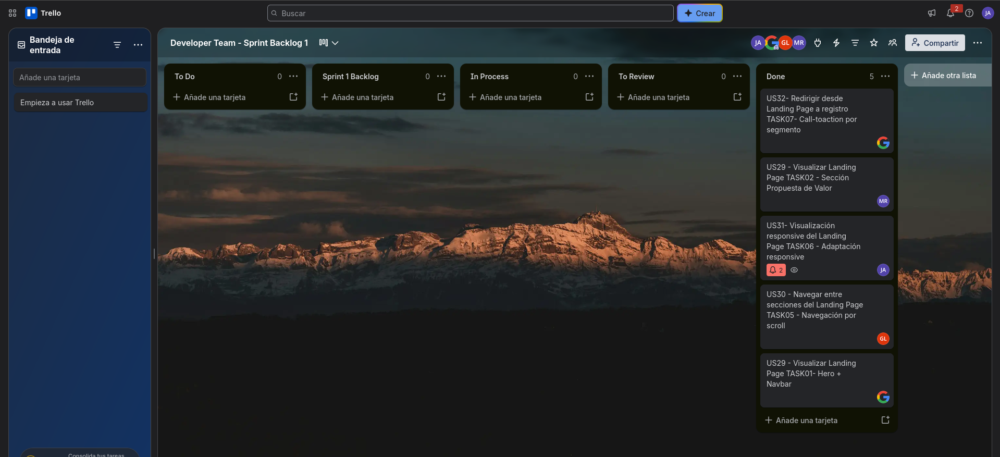
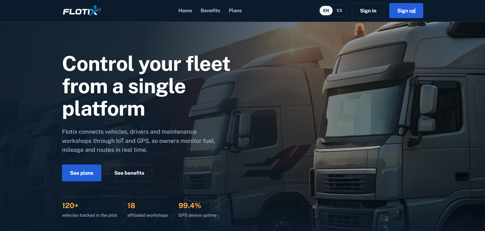
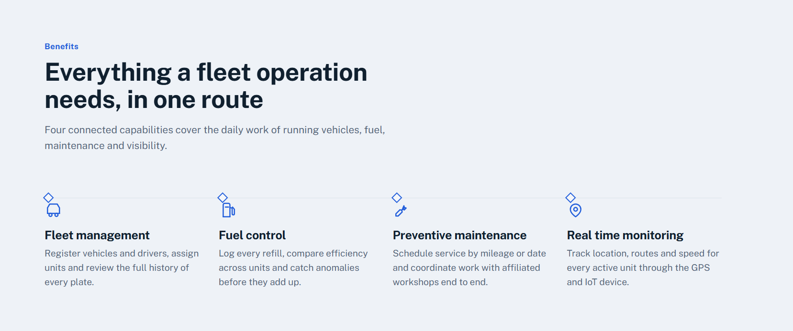
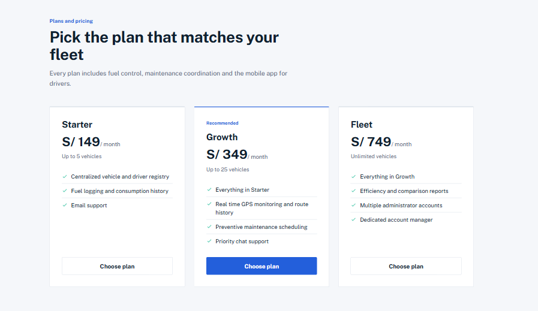
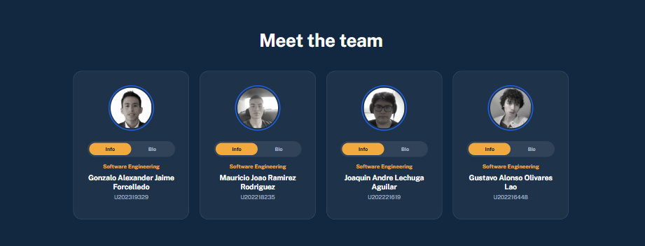
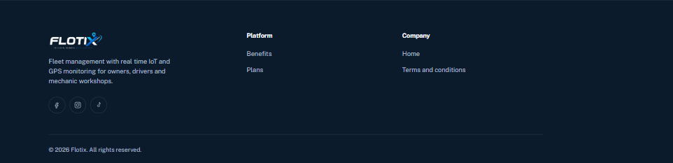
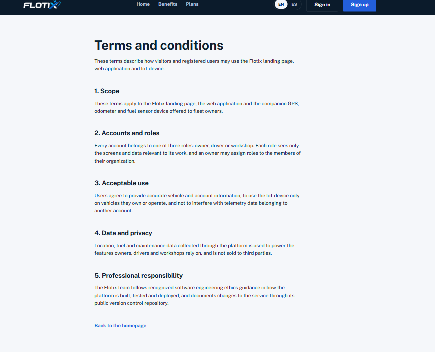
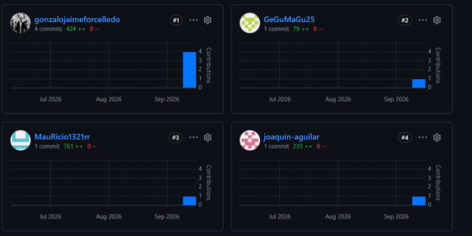

## 5.2. Landing Page, Services & Applications Implementation

En esta sección se describe el proceso de implementación del producto Flotix, incluyendo el desarrollo, pruebas, documentación y despliegue del Landing Page.

Para este avance (AV1), se implementó la primera versión del Landing Page, orientada a presentar la propuesta de valor de Flotix a los tres segmentos objetivo (Dueño, Conductor y Mecánica). El desarrollo se realizó utilizando tecnologías web estándar (HTML5, CSS3, JavaScript) y GitHub como herramienta de control de versiones.

### 5.2.1. Sprint 1

En esta sección se presenta el avance del Sprint 1 en términos de desarrollo del producto y trabajo colaborativo del equipo. Durante este sprint se realizó la implementación de la primera versión del Landing Page de Flotix, enfocada en presentar la propuesta de valor de la plataforma a los visitantes y guiarlos hacia el registro según su rol (Dueño, Conductor o Mecánica).

#### 5.2.1.1. Sprint Planning 1

| Campo | Detalle |
|---|---|
| **Sprint #** | Sprint 1 |
| **Sprint Planning Background** | |
| Date | 14-09-2026 |
| Time | 17:30 |
| Location | Reunión virtual (Google Meet / Microsoft Teams) |
| Prepared By / Attendees | Jaime Forcelledo, Gonzalo Alexander · Ramirez Rodriguez, Mauricio Joao |
| Sprint 1 – 1 Review Summary | Al tratarse del primer sprint del proyecto, no se cuenta con una iteración previa. Se tomó como base el Product Backlog priorizado y los principios de diseño definidos en el Capítulo IV (Style Guidelines e Information Architecture). |
| Sprint 1 – 1 Retrospective Summary | No aplica para este sprint. El equipo acordó enfocarse en una correcta distribución de tareas por sección del Landing Page y en mantener comunicación constante desde el inicio del desarrollo. |
| **Sprint Goal & User Stories** | |
| Sprint 1 Goal | Our focus is on developing a functional and responsive landing page that presents the value proposition of Flotix to vehicle owners, drivers, and mechanic workshops. We believe it delivers a clear understanding of the product and a direct path to registration for each segment. This will be confirmed when visitors can view the landing page, navigate between its sections, view it correctly across devices, and reach the registration flow from any call-to-action. |
| User Stories incluidas en el Sprint | US29: Visualizar Landing Page (3) · US30: Navegar entre secciones del Landing Page (2) · US31: Visualización responsive del Landing Page (5) · US32: Redirigir desde Landing Page a registro (3) |
| Sprint 1 Velocity | 13 Story Points |
| Sum of Story Points | 13 Story Points |

#### 5.2.1.2. Aspect Leaders and Collaborators

En esta sección se define la matriz de liderazgo y colaboración (LACX) del Sprint 1, la cual permite identificar las responsabilidades de cada integrante del equipo en los distintos aspectos del desarrollo del Landing Page.

*L = Leader · C = Collaborator*

| Team Member (Last Name, First Name) | GitHub Username | Estructura del Landing Page | Navegación entre secciones | Diseño Responsive |
|---|---|:---:|:---:|:---:|
| Jaime Forcelledo, Gonzalo Alexander | gonzalojaimeforcelledo | L | C | C |
| Ramirez Rodriguez, Mauricio | MauRicio1321rr | C | C | L |
| Olivares Lao, Gustavo | GeGuMaGu25 | C | C | C |
| Lechuga Aguilar, Joaquin | joaquin-aguilar | C | L | C |

#### 5.2.1.3. Sprint Backlog 1

El Sprint 1 tuvo como objetivo principal la implementación del Landing Page de Flotix, permitiendo presentar la propuesta de valor del sistema mediante una interfaz clara, estructurada y accesible para los tres segmentos objetivo. Para la gestión del Sprint Backlog se utiliza Trello, organizando los User Stories y sus respectivos Work-Items/Tasks en columnas según su estado de avance (To-do / In-Process / To-Review / Done).

**URL del Board:** https://trello.com/invite/b/6aa4d8d2372dbba6abaa9614/ATTI169be87b0916b465e22e953638c3ad30AFD2832F/developer-team-sprint-backlog-1

| User Story | Work-Item / Task | Descripción | Estimation (Hours) | Assigned To | Status |
|---|---|---|:---:|---|:---:|
| US29 - Visualizar Landing Page | TASK01 - Hero + Navbar | Implementación de la sección principal (Hero) y la barra de navegación del Landing Page | 4 | Gonzalo Jaime Forcelledo | Done |
| US29 - Visualizar Landing Page | TASK02 - Sección Propuesta de Valor | Desarrollo de la sección que presenta la propuesta de valor y los tres segmentos objetivo (Dueño, Conductor, Mecánica) | 4 | Mauricio Ramirez Rodriguez | Done |
| US30 - Navegar entre secciones del Landing Page | TASK05 - Navegación por scroll | Implementación del desplazamiento suave (smooth scroll) entre secciones desde el menú de navegación | 3 | Gustavo Olivares Lao | Done |
| US31 - Visualización responsive del Landing Page | TASK06 - Adaptación responsive | Adaptación de todas las secciones del Landing Page a dispositivos móviles y tablets mediante media queries | 5 | Joaquin Lechuga Aguilar | Done |
| US32 - Redirigir desde Landing Page a registro | TASK07 - Call-to-action por segmento | Implementación de los botones "Comenzar ahora" en cada sección, redirigiendo al registro con el rol correspondiente preseleccionado | 3 | Gonzalo Jaime Forcelledo | Done |

#### 5.2.1.4. Development Evidence for Sprint Review

En este Sprint se logró la implementación de la estructura principal del Landing Page de Flotix en HTML y CSS, junto con la navegación entre secciones y los primeros avances en el diseño responsive. El desarrollo se organizó mediante ramas de tipo feature en GitHub, permitiendo trabajar en paralelo en las distintas secciones del sitio. A continuación, se presentan los commits más relevantes asociados al desarrollo del Sprint 1.

| Repository | Branch | Commit Message | Commit Message Body | Committed on (Date) |
|---|---|---|---|:---:|
| flotix-website | feature/html | `feat(html): add file index.html` | Se implementa la estructura o esqueleto HTML | 16/09/2026 |
| flotix-website | feature/css | `feat(css): add css` | Se implementa los estilos a la estructura | 16/09/2026 |
| flotix-website | feature/images | `feat(images): add photos jpg png of images` | Se implementa las imágenes a la estructura con los estilos | 16/09/2026 |
| flotix-website | feature/javascript | `feat(javascript): add javascript main.js for dynamic` | Se implementa el idioma por i18n y hace la landing page dinámica | 16/09/2026 |

#### 5.2.1.5. Execution Evidence for Sprint Review

En el Sprint 1 se logró implementar el Landing Page de Flotix, permitiendo presentar la propuesta de valor del sistema a través de una interfaz clara, organizada y accesible para los tres segmentos objetivo. Se desarrollaron las principales secciones del Landing Page: Hero, propuesta de valor por segmento, dispositivo IoT, talleres afiliados y footer, además de la navegación entre secciones mediante scroll y los primeros avances en la adaptación responsive.

**Video de Demostración de Navegación (Landing Page):** https://n9.cl/xzcd89

**Screenshots del Landing Page**

> 

> *Vista general (Hero + Navbar)*

> 

> *Sección Beneficios*

> 

> *Sección Planes*

> 

> *Sección About the Team*

> 

> *Sección Footer*

> *Sección Términos y condiciones*

#### 5.2.1.6. Services Documentation Evidence for Sprint Review

En el presente Sprint no se implementaron Web Services ni endpoints funcionales, debido a que el alcance de esta primera entrega estuvo enfocado en el desarrollo del Landing Page como carta de presentación del producto.

#### 5.2.1.7. Software Deployment Evidence for Sprint Review

El despliegue del Landing Page de Flotix se realizó utilizando GitHub Pages, aprovechando su capacidad de publicar sitios web estáticos directamente desde un repositorio, sin necesidad de infraestructura adicional.

**Infraestructura de Despliegue**

- Repositorio de código fuente: GitHub (`flotix-landing`)

- Plataforma de despliegue: GitHub Pages

- Tipo de aplicación: sitio estático (HTML, CSS, JavaScript)

- Acceso: URL pública generada por GitHub

**Proceso de Despliegue**

1. **Creación del repositorio:** Se creó el repositorio `flotix-landing` conteniendo todos los archivos del Landing Page, asegurando que `index.html` se encuentre en la raíz.

2. **Subida del código:**

- Se realizó el push del proyecto a la rama principal (`main`) del repositorio.

- Se verificó que todos los recursos estén correctamente enlazados (rutas relativas).

3. **Configuración de GitHub Pages:**

- En la sección Settings del repositorio, se habilitó GitHub Pages.

- Se seleccionó la rama `main` como fuente de despliegue.

- Se definió la carpeta raíz (`/root`) como directorio de publicación.

4. **Publicación automática:**

- GitHub Pages procesó automáticamente el contenido del repositorio.

- En pocos minutos, generó una URL pública donde la Landing Page quedó disponible.

5. **Actualizaciones:**

- Cada vez que se realiza un nuevo push a la rama `main`, GitHub Pages actualiza automáticamente la página.

- Esto permite mantener la Landing Page sincronizada con los cambios del repositorio sin intervención manual adicional.

**Resultado**

La Landing Page de Flotix fue desplegada exitosamente mediante GitHub Pages, permitiendo su acceso público a través de una URL estable. Esto facilita la presentación del producto a usuarios potenciales y valida la propuesta de valor del sistema de manera rápida y efectiva.

**URL:** https://upc-pre-202620-1asi0730-8150-devsteam.github.io/flotix-website

#### 5.2.1.8. Team Collaboration Insights during Sprint

Durante el Sprint 1, el equipo Developers Team trabajó de manera colaborativa en la implementación del Landing Page de Flotix, organizando las tareas por sección de la interfaz para permitir el desarrollo en paralelo. Cada integrante asumió la responsabilidad de una parte específica del Landing Page (Hero, propuesta de valor, dispositivo IoT, talleres afiliados y footer), lo que permitió avanzar de forma eficiente y reducir conflictos en el código. Se utilizó GitHub como herramienta principal de control de versiones, gestionando el trabajo mediante ramas feature y commits individuales revisados antes de integrarse a develop.

La integración del trabajo se realizó de manera progresiva, consolidando las distintas secciones en una única versión funcional del Landing Page.

