## 5.2. Landing Page, Services & Applications Implementation

En esta sección se describe el proceso de implementación del producto Flotix, incluyendo el desarrollo, pruebas, documentación y despliegue del Landing Page.

Para este avance (AV1), se implementó la primera versión del Landing Page, orientada a presentar la propuesta de valor de Flotix a los tres segmentos objetivo (Dueño, Conductor y Mecánica). El desarrollo se realizó utilizando tecnologías web estándar (HTML5, CSS3, JavaScript) y GitHub como herramienta de control de versiones.

### 5.2.1. Sprint 1

En esta sección se presenta el avance del Sprint 1 en términos de desarrollo del producto y trabajo colaborativo del equipo. Durante este sprint se realizó la implementación de la primera versión del Landing Page de Flotix, enfocada en presentar la propuesta de valor de la plataforma a los visitantes y guiarlos hacia el registro según su rol (Dueño, Conductor o Mecánica).

#### 5.2.1.1. Sprint Planning 1

| Campo | Detalle |
|---|---|
| **Sprint #** | Sprint 1 |
| **Sprint Planning Background** | |
| Date | 14-09-2026 |
| Time | 17:30 |
| Location | Reunión virtual (Google Meet / Microsoft Teams) |
| Prepared By / Attendees | Jaime Forcelledo, Gonzalo Alexander · Ramirez Rodriguez, Mauricio Joao |
| Sprint 1 – 1 Review Summary | Al tratarse del primer sprint del proyecto, no se cuenta con una iteración previa. Se tomó como base el Product Backlog priorizado y los principios de diseño definidos en el Capítulo IV (Style Guidelines e Information Architecture). |
| Sprint 1 – 1 Retrospective Summary | No aplica para este sprint. El equipo acordó enfocarse en una correcta distribución de tareas por sección del Landing Page y en mantener comunicación constante desde el inicio del desarrollo. |
| **Sprint Goal & User Stories** | |
| Sprint 1 Goal | Our focus is on developing a functional and responsive landing page that presents the value proposition of Flotix to vehicle owners, drivers, and mechanic workshops. We believe it delivers a clear understanding of the product and a direct path to registration for each segment. This will be confirmed when visitors can view the landing page, navigate between its sections, view it correctly across devices, and reach the registration flow from any call-to-action. |
| User Stories incluidas en el Sprint | US29: Visualizar Landing Page (3) · US30: Navegar entre secciones del Landing Page (2) · US31: Visualización responsive del Landing Page (5) · US32: Redirigir desde Landing Page a registro (3) |
| Sprint 1 Velocity | 13 Story Points |
| Sum of Story Points | 13 Story Points |

#### 5.2.1.2. Aspect Leaders and Collaborators

En esta sección se define la matriz de liderazgo y colaboración (LACX) del Sprint 1, la cual permite identificar las responsabilidades de cada integrante del equipo en los distintos aspectos del desarrollo del Landing Page.

*L = Leader · C = Collaborator*

| Team Member (Last Name, First Name) | GitHub Username | Estructura del Landing Page | Navegación entre secciones | Diseño Responsive |
|---|---|:---:|:---:|:---:|
| Jaime Forcelledo, Gonzalo Alexander | gonzalojaimeforcelledo | L | C | C |
| Ramirez Rodriguez, Mauricio | MauRicio1321rr | C | C | L |
| Olivares Lao, Gustavo | GeGuMaGu25 | C | C | C |
| Lechuga Aguilar, Joaquin | joaquin-aguilar | C | L | C |

#### 5.2.1.3. Sprint Backlog 1

El Sprint 1 tuvo como objetivo principal la implementación del Landing Page de Flotix, permitiendo presentar la propuesta de valor del sistema mediante una interfaz clara, estructurada y accesible para los tres segmentos objetivo. Para la gestión del Sprint Backlog se utiliza Trello, organizando los User Stories y sus respectivos Work-Items/Tasks en columnas según su estado de avance (To-do / In-Process / To-Review / Done).

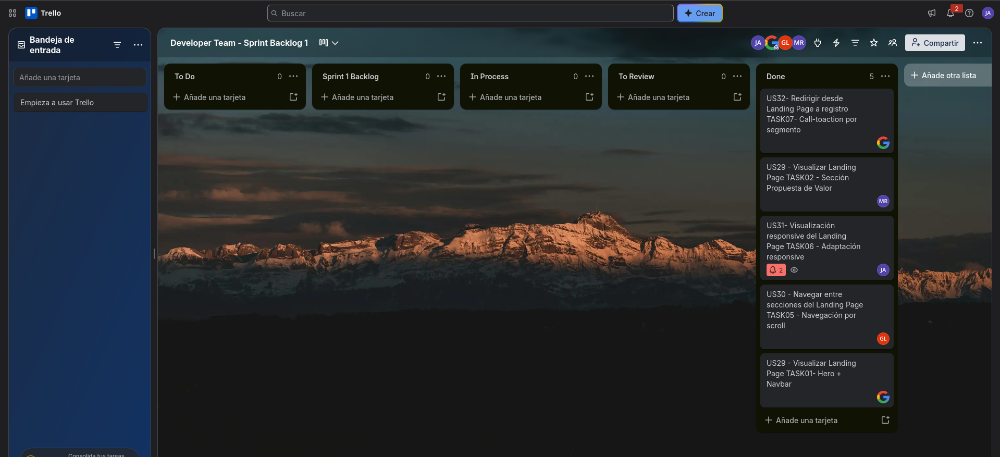

**URL del Board:** https://trello.com/invite/b/6aa4d8d2372dbba6abaa9614/ATTI169be87b0916b465e22e953638c3ad30AFD2832F/developer-team-sprint-backlog-1

| User Story | Work-Item / Task | Descripción | Estimation (Hours) | Assigned To | Status |
|---|---|---|:---:|---|:---:|
| US29 - Visualizar Landing Page | TASK01 - Hero + Navbar | Implementación de la sección principal (Hero) y la barra de navegación del Landing Page | 4 | Gonzalo Jaime Forcelledo | Done |
| US29 - Visualizar Landing Page | TASK02 - Sección Propuesta de Valor | Desarrollo de la sección que presenta la propuesta de valor y los tres segmentos objetivo (Dueño, Conductor, Mecánica) | 4 | Mauricio Ramirez Rodriguez | Done |
| US30 - Navegar entre secciones del Landing Page | TASK05 - Navegación por scroll | Implementación del desplazamiento suave (smooth scroll) entre secciones desde el menú de navegación | 3 | Gustavo Olivares Lao | Done |
| US31 - Visualización responsive del Landing Page | TASK06 - Adaptación responsive | Adaptación de todas las secciones del Landing Page a dispositivos móviles y tablets mediante media queries | 5 | Joaquin Lechuga Aguilar | Done |
| US32 - Redirigir desde Landing Page a registro | TASK07 - Call-to-action por segmento | Implementación de los botones "Comenzar ahora" en cada sección, redirigiendo al registro con el rol correspondiente preseleccionado | 3 | Gonzalo Jaime Forcelledo | Done |

#### 5.2.1.4. Development Evidence for Sprint Review

En este Sprint se logró la implementación de la estructura principal del Landing Page de Flotix en HTML y CSS, junto con la navegación entre secciones y los primeros avances en el diseño responsive. El desarrollo se organizó mediante ramas de tipo feature en GitHub, permitiendo trabajar en paralelo en las distintas secciones del sitio. A continuación, se presentan los commits más relevantes asociados al desarrollo del Sprint 1.

| Repository | Branch | Commit Message | Commit Message Body | Committed on (Date) |
|---|---|---|---|:---:|
| flotix-website | feature/html | `feat(html): add file index.html` | Se implementa la estructura o esqueleto HTML | 16/09/2026 |
| flotix-website | feature/css | `feat(css): add css` | Se implementa los estilos a la estructura | 16/09/2026 |
| flotix-website | feature/images | `feat(images): add photos jpg png of images` | Se implementa las imágenes a la estructura con los estilos | 16/09/2026 |
| flotix-website | feature/javascript | `feat(javascript): add javascript main.js for dynamic` | Se implementa el idioma por i18n y hace la landing page dinámica | 16/09/2026 |

#### 5.2.1.5. Execution Evidence for Sprint Review

En el Sprint 1 se logró implementar el Landing Page de Flotix, permitiendo presentar la propuesta de valor del sistema a través de una interfaz clara, organizada y accesible para los tres segmentos objetivo. Se desarrollaron las principales secciones del Landing Page: Hero, propuesta de valor por segmento, dispositivo IoT, talleres afiliados y footer, además de la navegación entre secciones mediante scroll y los primeros avances en la adaptación responsive.

**Video de Demostración de Navegación (Landing Page):** https://n9.cl/xzcd89

**Screenshots del Landing Page**

> 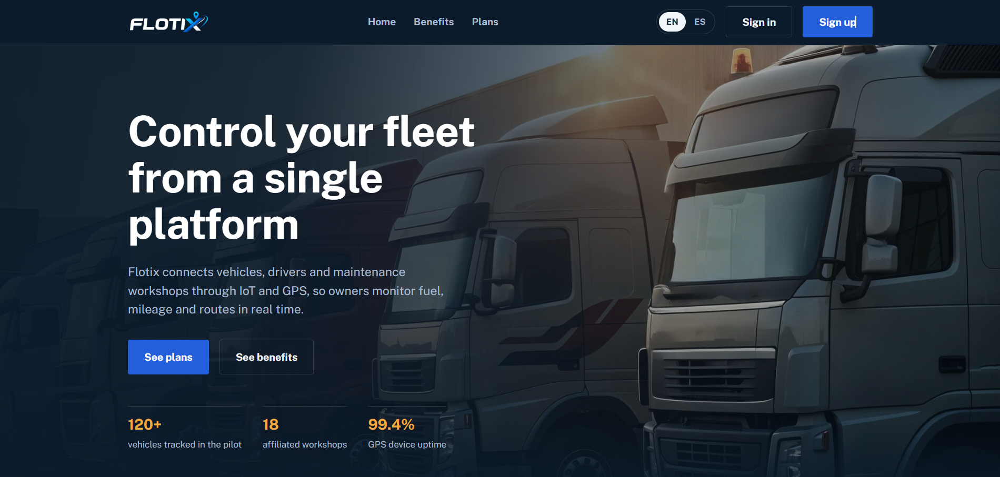

> *Vista general (Hero + Navbar)*

> 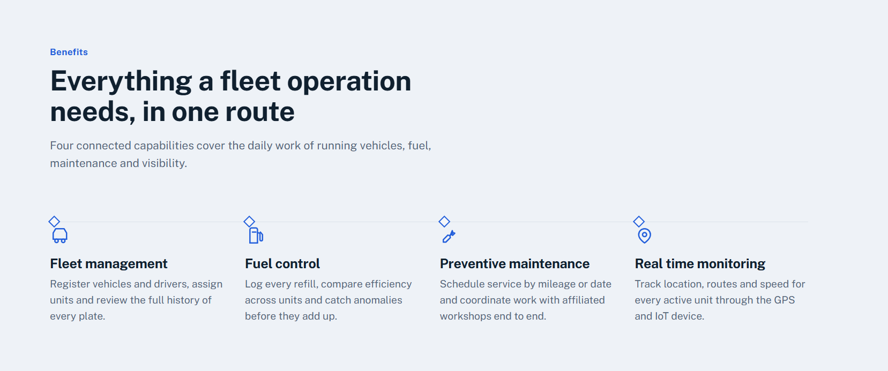

> *Sección Beneficios*

> 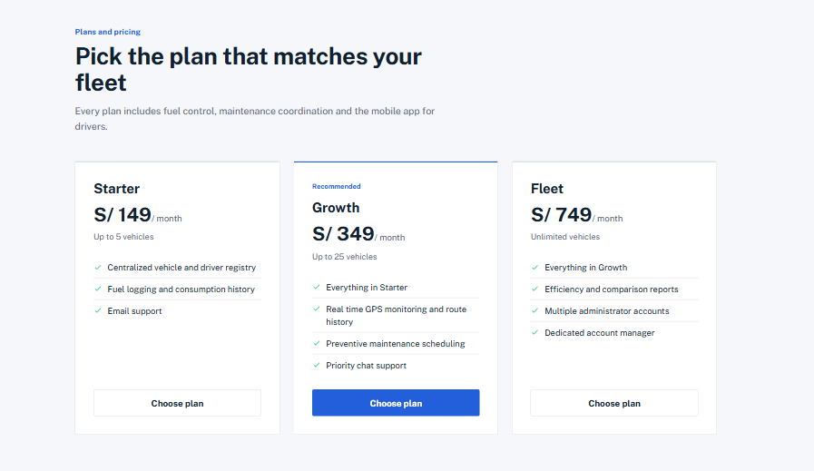

> *Sección Planes*

> 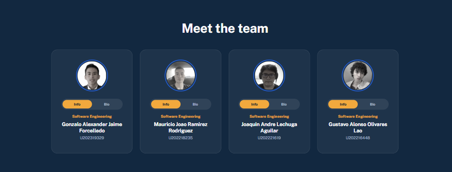

> *Sección About the Team*

> 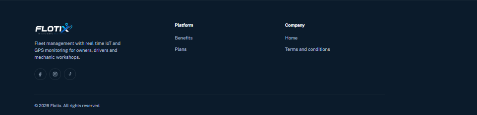

> *Sección Footer*

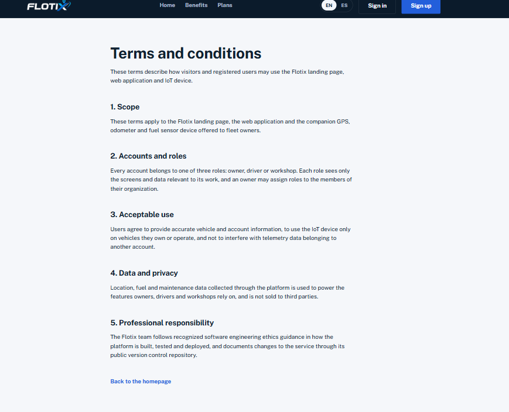

> *Sección Términos y condiciones*

#### 5.2.1.6. Services Documentation Evidence for Sprint Review

En el presente Sprint no se implementaron Web Services ni endpoints funcionales, debido a que el alcance de esta primera entrega estuvo enfocado en el desarrollo del Landing Page como carta de presentación del producto.

#### 5.2.1.7. Software Deployment Evidence for Sprint Review

El despliegue del Landing Page de Flotix se realizó utilizando GitHub Pages, aprovechando su capacidad de publicar sitios web estáticos directamente desde un repositorio, sin necesidad de infraestructura adicional.

**Infraestructura de Despliegue**

- Repositorio de código fuente: GitHub (`flotix-landing`)

- Plataforma de despliegue: GitHub Pages

- Tipo de aplicación: sitio estático (HTML, CSS, JavaScript)

- Acceso: URL pública generada por GitHub

**Proceso de Despliegue**

1. **Creación del repositorio:** Se creó el repositorio `flotix-landing` conteniendo todos los archivos del Landing Page, asegurando que `index.html` se encuentre en la raíz.

2. **Subida del código:**

- Se realizó el push del proyecto a la rama principal (`main`) del repositorio.

- Se verificó que todos los recursos estén correctamente enlazados (rutas relativas).

3. **Configuración de GitHub Pages:**

- En la sección Settings del repositorio, se habilitó GitHub Pages.

- Se seleccionó la rama `main` como fuente de despliegue.

- Se definió la carpeta raíz (`/root`) como directorio de publicación.

4. **Publicación automática:**

- GitHub Pages procesó automáticamente el contenido del repositorio.

- En pocos minutos, generó una URL pública donde la Landing Page quedó disponible.

5. **Actualizaciones:**

- Cada vez que se realiza un nuevo push a la rama `main`, GitHub Pages actualiza automáticamente la página.

- Esto permite mantener la Landing Page sincronizada con los cambios del repositorio sin intervención manual adicional.

**Resultado**

La Landing Page de Flotix fue desplegada exitosamente mediante GitHub Pages, permitiendo su acceso público a través de una URL estable. Esto facilita la presentación del producto a usuarios potenciales y valida la propuesta de valor del sistema de manera rápida y efectiva.

**URL:** https://upc-pre-202620-1asi0730-8150-devsteam.github.io/flotix-website

#### 5.2.1.8. Team Collaboration Insights during Sprint

Durante el Sprint 1, el equipo Developers Team trabajó de manera colaborativa en la implementación del Landing Page de Flotix, organizando las tareas por sección de la interfaz para permitir el desarrollo en paralelo. Cada integrante asumió la responsabilidad de una parte específica del Landing Page (Hero, propuesta de valor, dispositivo IoT, talleres afiliados y footer), lo que permitió avanzar de forma eficiente y reducir conflictos en el código. Se utilizó GitHub como herramienta principal de control de versiones, gestionando el trabajo mediante ramas feature y commits individuales revisados antes de integrarse a develop.

La integración del trabajo se realizó de manera progresiva, consolidando las distintas secciones en una única versión funcional del Landing Page.

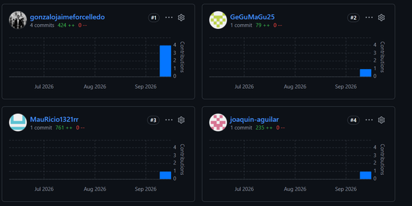

### 5.2.2. Sprint 2

En esta sección se registra y explica el avance en términos de producto y trabajo colaborativo para el Sprint 2. A diferencia del Sprint 1, enfocado exclusivamente en el Landing Page, este sprint entrega la primera versión completa de la Web Application de Flotix: los 9 Bounded Contexts definidos en el Capítulo IV (Identity, Fleet, Fuel Control, Maintenance, Incidents, Tracking, Alerts, IoT Commerce y Analytics), navegables de extremo a extremo para los tres roles (Dueño, Conductor, Mecánica), construida sobre una capa de persistencia local que replica el contrato de la futura API Application.

#### 5.2.2.1. Sprint Planning 2

| Campo | Detalle |
|---|---|
| **Sprint #** | Sprint 2 |
| **Sprint Planning Background** | |
| Date | 2026-09-21 |
| Time | 17:30 |
| Location | Reunión virtual (Google Meet) |
| Prepared By | Jaime Forcelledo, Gonzalo Alexander |
| Attendees (to planning meeting) | Jaime Forcelledo, Gonzalo Alexander · Ramirez Rodriguez, Mauricio Joao · Lechuga Aguilar, Joaquin Andre · Olivares Lao, Gustavo Alonso |
| Sprint 1 Review Summary | Durante el Sprint 1 se implementó y desplegó correctamente el Landing Page responsive de Flotix en GitHub Pages, cumpliendo las 4 User Stories planificadas (US29–US32). El equipo validó la navegación entre secciones y la adaptación a dispositivos móviles, y consolidó GitFlow y Conventional Commits como estándar de trabajo. |
| Sprint 1 Retrospective Summary | El equipo identificó como fortaleza la división del trabajo por sección del Landing Page. Como oportunidad de mejora, se acordó no bloquear el desarrollo del frontend a la espera del API Application: se definiría una capa de persistencia local que replique el contrato del backend real, permitiendo avanzar con los 9 Bounded Contexts en paralelo y swapear la implementación por un cliente HTTP una vez el API esté disponible. |
| **Sprint Goal & User Stories** | |
| Sprint 2 Goal | Our focus is on delivering the first complete version of the Flotix Web Application covering authentication, fleet and driver management, fuel control, preventive maintenance with workshops, incident reporting, real-time IoT tracking, alerts, the IoT device store, and analytics for the three user roles (Dueño, Conductor, Mecánica), built against a local persistence layer that mirrors the target API Application's contract. We believe it delivers a complete, navigable product experience the team can validate end-to-end before the real backend is integrated. This will be confirmed when each of the three demo accounts (Owner, Driver, Mechanic) can log in and operate every module relevant to their role, with the business rules from Chapters I and III enforced in the UI. |
| User Stories / Epics incluidos | EP05 Identity, Profiles & Security (login, registro, sesión por rol) EP01 Vehicle & Fleet Management (vehículos, conductores) EP02 Fuel Control (registro e historial de combustible) EP03 Maintenance Management (solicitudes, cotizaciones, talleres) · Incident Management (reporte de incidencias) EP04 Real-Time Monitoring (tracking IoT) · Alerts & Notifications EP06 IoT Commerce (tienda de dispositivos) · Reporting & Analytics |
| Sprint 2 Velocity | 33 Story Points |
| Sum of Story Points | 33 Story Points |

#### 5.2.2.2. Aspect Leaders and Collaborators

En esta sección se define la matriz de liderazgo y colaboración (LACX) del Sprint 2. Dado que el alcance cubre los 9 Bounded Contexts del frontend, los aspectos se organizan por Bounded Context en lugar de por sección visual.

| Team Member | GitHub Username | Identity + Platform Shell | Fleet + Analytics | Fuel + Maintenance | Tracking + Alerts + Commerce |
|---|---|:---:|:---:|:---:|:---:|
| Jaime Forcelledo, Gonzalo Alexander | gonzalojaimeforcelledo | L | C | C | C |
| Ramirez Rodriguez, Mauricio | MauRicio1321rr | C | L | C | C |
| Lechuga Aguilar, Joaquin | joaquin-aguilar | C | C | L | C |
| Olivares Lao, Gustavo | GeGuMaGu25 | C | C | C | L |

#### 5.2.2.3. Sprint Backlog 2

El Sprint 2 tuvo como objetivo principal construir la Web Application completa de Flotix siguiendo Domain-Driven Design, con una carpeta independiente por Bounded Context (domain / application / infrastructure / presentation), autenticación por rol y una capa de persistencia local que mantiene el mismo contrato que tendrá el futuro cliente HTTP contra el API Application.

**URL del Board:** https://trello.com/invite/b/6ac1585ab6a4d7605848bae2/ATTI1c6deef09403b58e03ceda301a4bbe43F73C7F73/developer-team-sprint-backlog-2

> 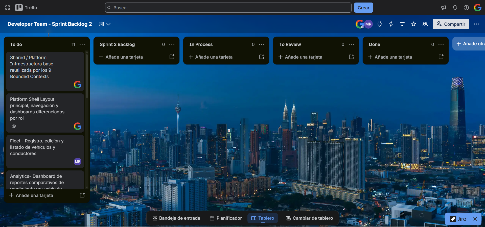
> *Tablero Trello del Sprint 2: tareas en To do*

> 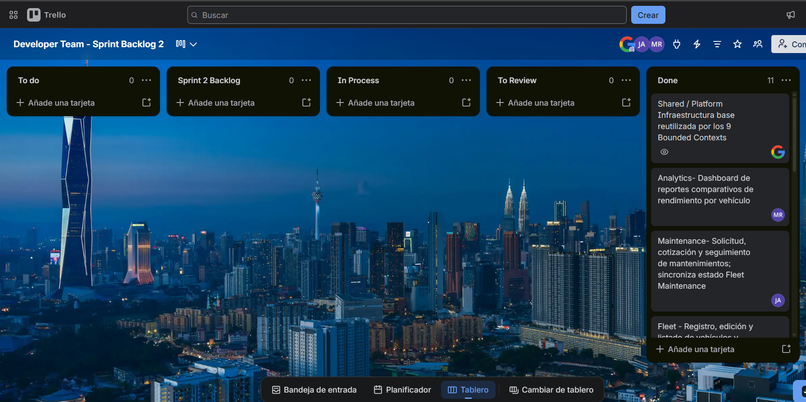
> *Tablero Trello del Sprint 2: tareas en Done*

| Bounded Context | Work-Item / Task | Descripción | Hrs | Assigned To | Status |
|---|---|---|:---:|---|:---:|
| Shared / Platform | Kernel compartido: `BaseEntity`, `LocalStorageRepository`, `session.js` | Infraestructura base reutilizada por los 9 Bounded Contexts | 5 | Gonzalo | Done |
| Platform Shell | `main-layout.component.vue`, dashboards por rol, `settings.view.vue`, `not-found.view.vue` | Layout principal, navegación y dashboards diferenciados por rol | 8 | Gonzalo | Done |
| Fleet | `fleet-list.view.vue`, `vehicle-form.view.vue`, `drivers-list.view.vue` | Registro, edición y listado de vehículos y conductores | 6 | Mauricio | Done |
| Analytics | `analytics-dashboard.view.vue`, `report.entity.js` | Dashboard de reportes comparativos de rendimiento por vehículo | 4 | Mauricio | Done |
| Fuel Control | `fuel-list.view.vue`, `fuel-form.view.vue`, `fuel-record.entity.js` | Registro e historial de combustible, detección de consumo anómalo (&lt;70% del promedio) | 5 | Joaquin | Done |
| Maintenance | `maintenance-*-form.view.vue`, `workshops-list.view.vue`, `workshop-request-form.view.vue` | Solicitud, cotización y seguimiento de mantenimientos; sincroniza estado Fleet ↔ Maintenance | 9 | Joaquin | Done |
| Incidents | `incidents-list.view.vue`, `incident-form.view.vue` | Reporte de incidencias; dispara notificación automática al Dueño | 4 | Joaquin | Done |
| Tracking | `tracking-dashboard.view.vue`, `iot-device.entity.js`, `telemetry-data.entity.js` | Monitoreo en tiempo real simulado, evaluación de límite de velocidad (90 km/h) | 6 | Gustavo | Done |
| Alerts | `alerts-list.view.vue`, `alert.entity.js`, `notification.entity.js` | Listado centralizado de alertas y notificaciones (Tracking + Incidents) | 3 | Gustavo | Done |
| IoT Commerce | `commerce-store.view.vue`, `iot-order.entity.js` | Tienda del dispositivo IoT; confirma pago simulado y cambia pedido a "En preparación" | 4 | Gustavo | Done |
| Platform Shell | `plugins/i18n.js`, `content.js`, `theme/flotix-preset.js` | Internacionalización (EN por defecto / ES-419) y theme preset de PrimeVue | 4 | Gonzalo | Done |

#### 5.2.2.4. Development Evidence for Sprint Review

En este Sprint se implementó la estructura completa de la Web Application en Vue 3 + Vite, con Pinia para el estado, PrimeVue/PrimeFlex para los componentes de UI y vue-i18n para la internacionalización. El desarrollo se organizó mediante una rama `feature/<bounded-context>` por cada uno de los 9 Bounded Contexts, integradas a `develop` a través de Pull Requests.

| Repository | Branch | Committed By | Date |
|---|---|---|:---:|
| flotix-webapp | develop | gonzalojaimeforcelledo | 2026-10-03 |
| flotix-webapp | feature/shared-kernel | gonzalojaimeforcelledo | 2026-10-03 |
| flotix-webapp | develop | gonzalojaimeforcelledo | 2026-10-03 |
| flotix-webapp | feature/identity | gonzalojaimeforcelledo | 2026-10-03 |
| flotix-webapp | feature/identity | gonzalojaimeforcelledo | 2026-10-03 |
| flotix-webapp | develop | gonzalojaimeforcelledo | 2026-10-03 |
| flotix-webapp | feature/platform-shell | gonzalojaimeforcelledo | 2026-10-03 |
| flotix-webapp | feature/platform-shell | gonzalojaimeforcelledo | 2026-10-03 |
| flotix-webapp | feature/platform-shell | gonzalojaimeforcelledo | 2026-10-03 |
| flotix-webapp | develop | MauRicio1321rr | 2026-10-03 |
| flotix-webapp | feature/fleet | MauRicio1321rr | 2026-10-03 |
| flotix-webapp | feature/fleet | MauRicio1321rr | 2026-10-03 |
| flotix-webapp | develop | MauRicio1321rr | 2026-10-03 |
| flotix-webapp | feature/analytics | MauRicio1321rr | 2026-10-03 |
| flotix-webapp | develop | joaquin-aguilar | 2026-10-03 |
| flotix-webapp | feature/fuel-control | joaquin-aguilar | 2026-10-03 |
| flotix-webapp | feature/fuel-control | joaquin-aguilar | 2026-10-03 |
| flotix-webapp | develop | joaquin-aguilar | 2026-10-03 |
| flotix-webapp | feature/maintenance | joaquin-aguilar | 2026-10-03 |
| flotix-webapp | feature/maintenance | joaquin-aguilar | 2026-10-03 |
| flotix-webapp | feature/incidents | joaquin-aguilar | 2026-10-03 |
| flotix-webapp | develop | GeGuMaGu25 | 2026-10-03 |
| flotix-webapp | feature/tracking | GeGuMaGu25 | 2026-10-03 |
| flotix-webapp | feature/tracking | GeGuMaGu25 | 2026-10-03 |
| flotix-webapp | develop | GeGuMaGu25 | 2026-10-03 |
| flotix-webapp | feature/alerts | GeGuMaGu25 | 2026-10-03 |
| flotix-webapp | feature/iot-commerce | GeGuMaGu25 | 2026-10-03 |

#### 5.2.2.5. Execution Evidence for Sprint Review

En el Sprint 2 se logró implementar y navegar de extremo a extremo la primera versión de la Web Application de Flotix para los tres roles. Las reglas de negocio centrales ya operan sobre la UI: licencia obligatoria para Conductor, sincronización de estado Fleet ↔ Maintenance durante una reparación, detección de consumo anómalo de combustible, disparo de alertas desde Incidents y Tracking, confirmación de pago en IoT Commerce, y exclusión de vehículos con menos de 2 registros históricos en Analytics.

**Video de Demostración de Navegación (Web Application):** https://acortar.link/h01YBa

**Screenshots de la Web Application**

**Dueño:**

> 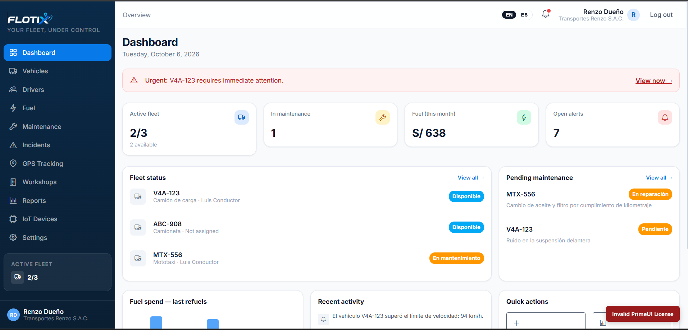
> *Dashboard del Dueño*

**Conductor:**

> 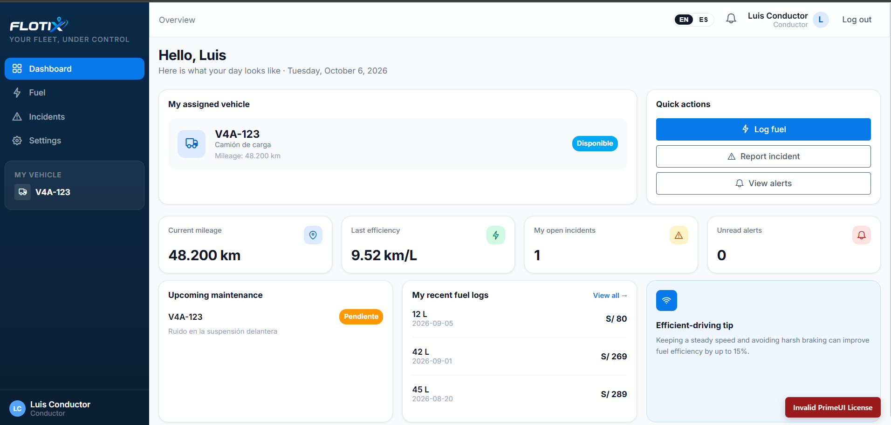
> *Dashboard del Conductor*

**Mecánica:**

> 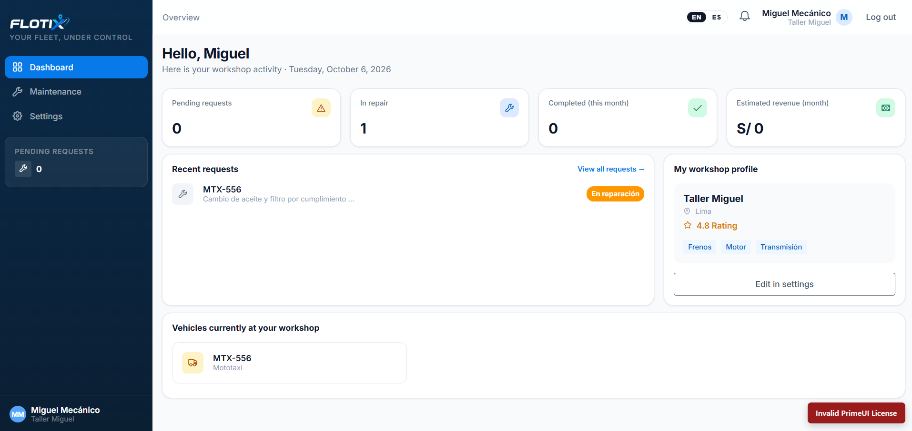
> *Dashboard de la Mecánica*

#### 5.2.2.6. Services Documentation Evidence for Sprint Review

En este Sprint no se implementaron Web Services reales: el API Application (C# / .NET Core Minimal APIs, descrita en el Container Diagram del Capítulo IV) se desarrollará en un sprint posterior. Para no bloquear el avance del frontend, cada Bounded Context persiste sus datos mediante LocalStorageRepository, una clase de infraestructura genérica que replica exactamente el contrato que expondrá el repositorio real contra la API (getAll, getById, findBy, add, update, remove).

| Método del contrato | Equivalente futuro en la API |
|---|---|
| `getAll()` | `GET /api/<recurso>` |
| `getById(id)` | `GET /api/<recurso>/{id}` |
| `add(record)` | `POST /api/<recurso>` |
| `update(id, patch)` | `PUT /api/<recurso>/{id}` |
| `remove(id)` | `DELETE /api/<recurso>/{id}` |

Esto permite que, cuando el API Application esté disponible, solo se reemplace la capa de infraestructura de cada Bounded Context (el repositorio) por un cliente HTTP sin tocar las capas de aplicación ni de presentación.

**Repositorio del frontend:** https://github.com/upc-pre-202620-1asi0730-8150-DevsTeam/flotix-webapp

#### 5.2.2.7. Software Deployment Evidence for Sprint Review

Al ser, por ahora, una SPA sin backend real, el despliegue del Sprint 2 se limita a publicar el build estático de la Web Application.

**Infraestructura utilizada**

- GitHub como repositorio principal (`flotix-webapp`).
- GitHub Pages para el despliegue del Landing Page.
- Vue.js + Vite para la construcción de la Web Application.

**Proceso de Deployment**

1. **Build de producción:** se generó el build de la Web Application con Vite (`npm run build`), produciendo la carpeta `dist/`.
2. **Publicación:** se desplegó el contenido de `dist/` en la plataforma de hosting estático elegida.
3. **Verificación:** se probó el flujo (Owner, Driver, Mechanic), confirmando que cada rol ve únicamente su dashboard y navegación correspondiente.
4. **Persistencia:** se documentó que los datos se almacenan en `localStorage` del navegador (con datos semilla), por lo que cada visitante parte de un estado demo independiente hasta la integración con el API Application real.

**Resultado**

Se logró desplegar la primera versión completa de la Web Application de Flotix, cubriendo los 9 Bounded Contexts definidos en el Capítulo IV, navegable de extremo a extremo para los tres roles sobre datos de demostración.

**URL Web Application:** *https://flotix-app-web.netlify.app/dashboard*

#### 5.2.2.8. Team Collaboration Insights during Sprint

Durante el Sprint 2, el equipo Developers Team distribuyó el trabajo por Bounded Context siguiendo estrictamente la arquitectura DDD definida en el Capítulo IV: Gonzalo Jaime Forcelledo lideró el kernel compartido, Identity y el shell de la plataforma (layout, dashboards por rol, i18n y theme); Mauricio Ramirez Rodriguez lideró Fleet y Analytics; Joaquin Lechuga Aguilar lideró Fuel Control, Maintenance e Incidents; y Gustavo Olivares Lao lideró Tracking, Alerts e IoT Commerce.

Siguiendo la retrospectiva del Sprint 1, el equipo decidió no esperar al API Application para avanzar: se acordó un contrato de repositorio único que los cuatro integrantes reutilizaron en sus respectivos Bounded Contexts, lo que permitió que los 9 módulos se desarrollaran en paralelo sin bloqueos entre sí. El trabajo se organizó mediante GitHub con GitFlow, una rama `feature/<bounded-context>` por módulo, y Pull Requests revisados por al menos un integrante antes de cada merge a `develop`.

> 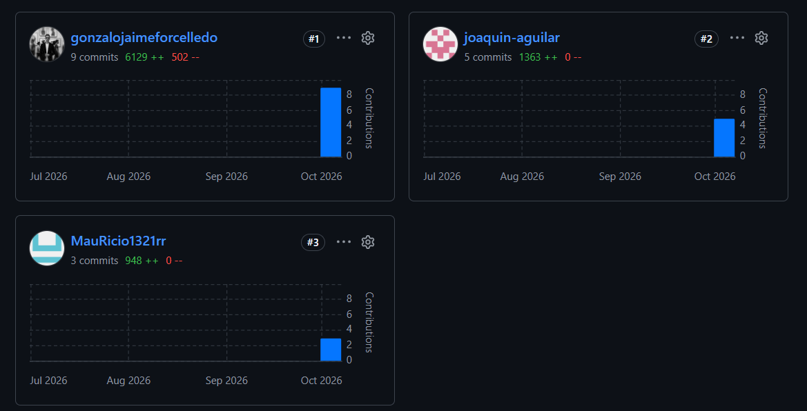

