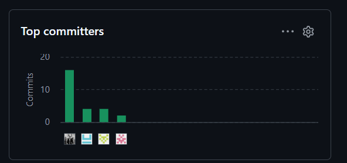

# Project Report Collaboration Insights

El repositorio público del informe se encuentra organizado bajo la organización de GitHub del equipo, siguiendo la convención de nomenclatura establecida en el enunciado del trabajo final. El informe está redactado en formato Markdown y organizado en un archivo por sección dentro de la carpeta `report/`, con los recursos gráficos en la carpeta `assets/`.

**Repositorio del informe:**
[https://github.com/upc-pre-202620-1asi0730-8150-DevsTeam/flotix-report](https://github.com/upc-pre-202620-1asi0730-8150-DevsTeam/flotix-report)

El repositorio aplica **GitFlow** como workflow de control de versiones y **Conventional Commits** para los mensajes de commit.

Los commits reflejados en esta sección corresponden únicamente al repositorio del informe (flotix-report). Los commits de código de los repositorios de Landing Page, Frontend y Web Services se registran en sus respectivos repositorios.

## AV1 – Sprint Review (Semana 4)

Durante la elaboración de la entrega AV1, el equipo se organizó asignando a cada integrante capítulos y secciones específicas del informe. Se realizaron sesiones de revisión conjunta vía Discord y se utilizó la rama `main` para consolidar el informe antes de la exportación a PDF. Cada integrante creó su propia *feature branch* siguiendo la convención establecida.

| Integrantes | Actividades realizadas en el informe |
|---|---|
| Jaime Forcelledo, Gonzalo Alexander | Elaboró la Carátula, Registro de Versiones del Informe, Project Report Collaboration Insights y la sección Student Outcome. Coordinó la integración de todos los capítulos en la rama `develop` y realizó el merge final a `main`. |
| Ramirez Rodriguez, Mauricio Joao | Desarrolló el Capítulo II (Requirements Elicitation & Analysis): diseñó y registró las entrevistas de needfinding, elaboró los User Personas, User Task Matrix, User Journey Mapping, Empathy Maps y Big Picture EventStorming. Redactó el Ubiquitous Language del dominio de transporte. |
| Lechuga Aguilar, Joaquin Andre | Desarrolló el Capítulo III (Requirements Specification) con los User Stories y Epics completos con Acceptance Criteria en formato Gherkin, el Impact Mapping y el Product Backlog priorizado. Adicionalmente elaboró las secciones de Style Guidelines y gran parte del Capítulo IV. |
| Olivares Lao, Gustavo Alonso | Completó el Capítulo IV (Product Design) con la propuesta de Information Architecture, Landing Page Wireframes y Mockups, Web Application Wireframes, Wireflow Diagrams y Mockups. Configuró el repositorio de la Landing Page e implementó el Sprint 1 completo (sección 5.2.1). |

## TB1 – Stage Review (Semana 7)

Durante la elaboración de la entrega TB1, el equipo corrigió y mejoró los artefactos de AV1 a partir de la retroalimentación del docente y agregó las secciones correspondientes al Sprint 2. Cada integrante asumió el liderazgo de los capítulos de su especialidad, trabajó en su propia *feature branch* siguiendo GitFlow y Conventional Commits, y las revisiones conjuntas permitieron integrar los cambios en la rama `develop` antes de su consolidación en `main` para la exportación a PDF.

| Integrantes | Actividades realizadas en el informe |
|---|---|
| Jaime Forcelledo, Gonzalo Alexander | Lideró la actualización del Capítulo I, corrigiendo el Lean UX Process a partir de la retroalimentación recibida en AV1. Actualizó la Carátula, el Registro de Versiones del Informe y la sección Student Outcome con las acciones de TB1. Elaboró la sección 5.2.2 (Sprint 2), las Conclusiones y recomendaciones, los Anexos y la Tabla de Contenido. Además, publicó la nueva versión del Landing Page con las secciones About the Product y About the Team. |
| Ramirez Rodriguez, Mauricio Joao | Lideró la actualización del Capítulo II, mejorando las secciones de Needfinding y Big Picture EventStorming, y actualizó el Ubiquitous Language del dominio. En el Capítulo III reorganizó las User Stories y el Product Backlog en función de los bounded contexts de la solución, coordinando con el equipo la priorización por valor de negocio. |
| Lechuga Aguilar, Joaquin Andre | Lideró las correcciones del Capítulo IV: actualizó los wireframes y mock-ups del Landing Page, incorporando las secciones "Flotix in action" y "Team behind Flotix", y los de la Web Application. Corrigió los prototipos de la Web Application y las rutas de sus archivos en la sección 4.5 Web Applications Prototyping. |

